# Memory Layer — Implementation Reference Specification

**Version:** 1.0
**Date:** 2026-05-24
**Status:** Implementation-grade. This document is framework-agnostic; concrete code references point to the z-Bot Rust implementation as a canonical reference, but every interface, algorithm, and data structure described here can be implemented in any language with a SQL store (or equivalent), a vector index (or ANN service), a lexical search engine (BM25 or equivalent), and an LLM client.

---

## Table of Contents

1. [Overview & Design Principles](#1-overview--design-principles)
2. [The Layered Memory Architecture](#2-the-layered-memory-architecture)
3. [Data Model — ER Diagrams](#3-data-model--er-diagrams)
4. [Layer 1 — Episodic & Atomic Facts](#4-layer-1--episodic--atomic-facts)
5. [Layer 2 — Knowledge Graph](#5-layer-2--knowledge-graph)
6. [Layer 3 — Bi-Temporal Semantics](#6-layer-3--bi-temporal-semantics)
7. [Layer 4 — Hierarchical Memory (LeanRAG)](#7-layer-4--hierarchical-memory-leanrag)
8. [Layer 5 — Belief Network](#8-layer-5--belief-network)
9. [Layer 6 — Procedures](#9-layer-6--procedures)
10. [Layer 7 — Reflective Synthesis (Sleep-Time Pipeline)](#10-layer-7--reflective-synthesis-sleep-time-pipeline)
11. [Recall Engine](#11-recall-engine)
12. [The Six Memory Loops](#12-the-six-memory-loops)
13. [Distillation Pipeline (Post-Session)](#13-distillation-pipeline-post-session)
14. [Confidence & Decay](#14-confidence--decay)
15. [Configuration](#15-configuration)
16. [Framework-Agnostic Interfaces](#16-framework-agnostic-interfaces)
17. [Implementation Sequencing](#17-implementation-sequencing)
18. [Verification & Test Strategy](#18-verification--test-strategy)
19. [Glossary](#19-glossary)

---

## 1. Overview & Design Principles

### 1.1 What this spec describes

A persistent, self-improving memory subsystem for an autonomous agent. The subsystem provides:

- **Recall** — relevance-ranked retrieval of past facts, episodes, graph context, beliefs, procedures, and hierarchical summaries, given a free-form query.
- **Distillation** — extraction of structured knowledge (facts, entities, relationships, episodes) from raw session transcripts after each user interaction.
- **Reflection** — a background pipeline that abstracts patterns, synthesises beliefs, resolves contradictions, mines procedures, and builds hierarchical summaries over time.
- **Bi-temporal truth** — facts and relationships carry "when they were true" alongside "when they were learned," enabling point-in-time queries and conflict-aware supersession.
- **Hierarchical clustering** — a layered summary tree (HiRAG / LeanRAG) so recall can navigate from high-level concepts down to atomic evidence.

### 1.2 The cognitive thesis

A useful agent memory is not a key-value cache. It is a stack of interpretive layers:

| Question the agent asks | Layer that answers it |
|--|--|
| "What did I literally observe?" | Episodic + atomic facts |
| "What real-world things does this concern, and how do they connect?" | Knowledge graph |
| "What was true when?" | Bi-temporal semantics |
| "What's the bigger concept this belongs to?" | Hierarchical summaries |
| "What do I currently believe (across many facts)?" | Belief network |
| "How have I done this before?" | Procedures |
| "What patterns emerge that I should formalise?" | Reflective synthesis |

Each layer is independently useful. A minimum-viable implementation can ship Layer 1 alone. Layers 2-7 compose on top, in roughly that order of dependency.

### 1.3 Design principles (invariants)

1. **Tool-call recall, not hidden injection.** The agent explicitly issues recall actions; results are visible, debuggable, and learnable. (One exception: the system-recall loop injects a system message at session boot — see §12.)
2. **Bi-temporal everything that ages.** Facts, entities, relationships, beliefs all carry `valid_from` and `valid_until`. The current truth is `valid_until IS NULL OR valid_until > now()`. Historic truth is queryable.
3. **Supersession over delete.** Stale knowledge is marked superseded with a transition timestamp; it is never destroyed. Decay archives, it does not erase.
4. **Conservative reflection.** The background pipeline never fails hard. A single stage erroring is logged at WARN and the cycle continues. Defaults that affect correctness (e.g. entity merge) default to deny on error.
5. **Idempotent writes.** All reflective stages can re-run on the same input and produce the same output (within floating-point tolerance). Beliefs, facts, procedures upsert by unique key.
6. **Deterministic reflection.** All reflective LLM calls use `temperature = 0.0`. The handoff summariser uses `0.2` (one exception, for fluency).
7. **Embedding is best-effort.** Embedding failures degrade gracefully — beliefs and procedures are written with `embedding = NULL`. Embeddings improve recall but are never required for correctness.
8. **Confidence is a continuous dimension.** Every fact, entity, relationship, and belief carries a `[0.0, 1.0]` confidence. Recall scoring multiplies by it; decay reduces it; archive removes below floor.
9. **Multi-tenant from day one.** Every row carries `agent_id` and `ward_id` (or scope). Cross-agent global knowledge uses sentinel `__global__`.
10. **Reflection is opt-in per layer.** Belief network, hierarchy builder, predictive recall all gate on configuration flags. A minimal deployment runs Layers 1+2 only and is still useful.

### 1.4 Scope guard — what this spec does NOT cover

- **Agent loop / orchestration** — the executor, tool dispatch, delegation. The memory layer is consumed by these, not part of them.
- **Specific provider integrations** — the spec assumes an `EmbeddingClient` and an LLM client trait; how those connect to OpenAI / Anthropic / Ollama is out of scope.
- **UI for memory** — observability dashboards, knowledge-graph visualisation are downstream.
- **Skill / agent registries** — these are application-layer concepts that happen to use the same `memory_facts` table as a generic store; their indexing logic is separate.

---

## 2. The Layered Memory Architecture

### 2.1 Layer stack

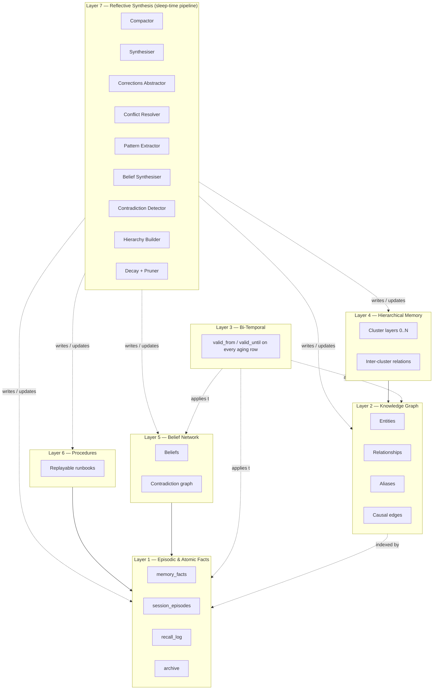

### 2.2 Layer summary

| # | Layer | Primary tables | What it answers | Required? |
|--|--|--|--|--|
| 1 | Episodic & atomic facts | `memory_facts`, `session_episodes`, `recall_log`, `memory_facts_archive` | "What did I observe? What facts have I learned?" | Yes — MVP |
| 2 | Knowledge graph | `kg_entities`, `kg_relationships`, `kg_aliases`, `kg_causal_edges`, `kg_episodes` | "What real-world things, and how do they connect?" | Strongly recommended |
| 3 | Bi-temporal | Columns on Layers 1, 2, 5 | "What was true when?" | Strongly recommended |
| 4 | Hierarchical (LeanRAG) | `kg_entities.layer` + `parent_cluster_id`, `kg_relationships.is_inter_cluster` | "What broader concept does this belong to?" | Optional / opt-in |
| 5 | Belief network | `kg_beliefs`, `kg_belief_contradictions` | "What do I currently hold to be true, across many facts?" | Optional / opt-in |
| 6 | Procedures | `procedures` | "How have I done this before? Can I replay it?" | Strongly recommended |
| 7 | Reflective synthesis | (pipeline, no schema of its own) | "Make all of the above better over time" | Strongly recommended |

### 2.3 Read path (recall) overview

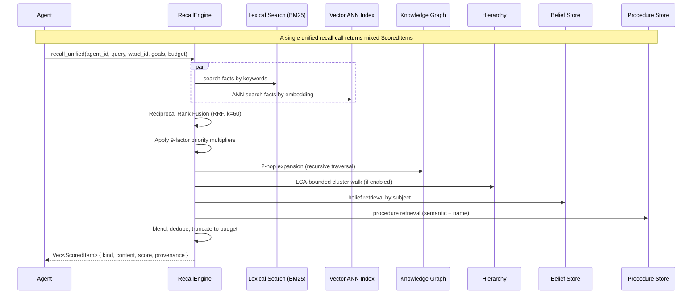

### 2.4 Write path overview

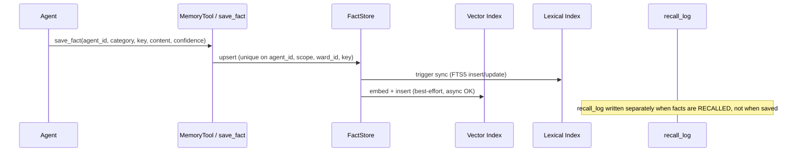

### 2.5 Reflection path (background)

See [§10](#10-layer-7--reflective-synthesis-sleep-time-pipeline) for the full sleep-time pipeline. Compressed view:

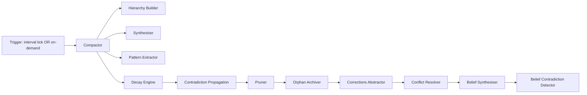

---

## 3. Data Model — ER Diagrams

The data model is split across two logical databases:

- **`conversations.db`** (operational) — sessions, executions, messages, logs, artifacts, bridge outbox, recall audit
- **`knowledge.db`** (cognitive) — all memory layers, knowledge graph, beliefs, procedures, vector indexes, embedding cache

A single-DB deployment is perfectly valid; the split exists to allow independent backup / replication / scaling of operational vs cognitive state.

### 3.1 Episodic & atomic facts (Layer 1)

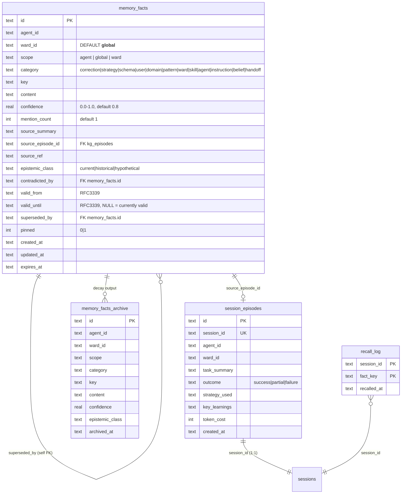

**Unique constraint:** `(agent_id, scope, ward_id, key)` — upsert key. Re-saving the same fact updates content, bumps `mention_count`.

### 3.2 Knowledge graph (Layer 2)

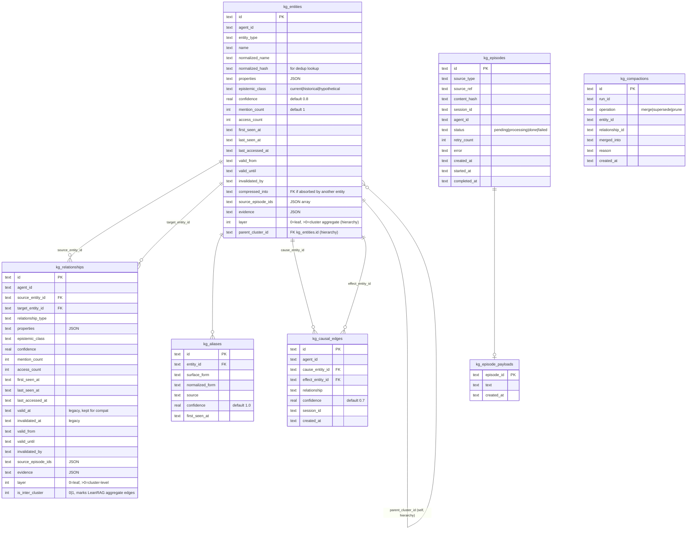

**Uniqueness:**
- `kg_entities`: `(agent_id, entity_type, normalized_hash)` — lookup index
- `kg_relationships`: `UNIQUE (source_entity_id, target_entity_id, relationship_type)` — prevents duplicate edges
- `kg_aliases`: `UNIQUE (normalized_form, entity_id)`
- `kg_episodes`: `UNIQUE (content_hash, source_type)`

### 3.3 Belief network (Layer 5)

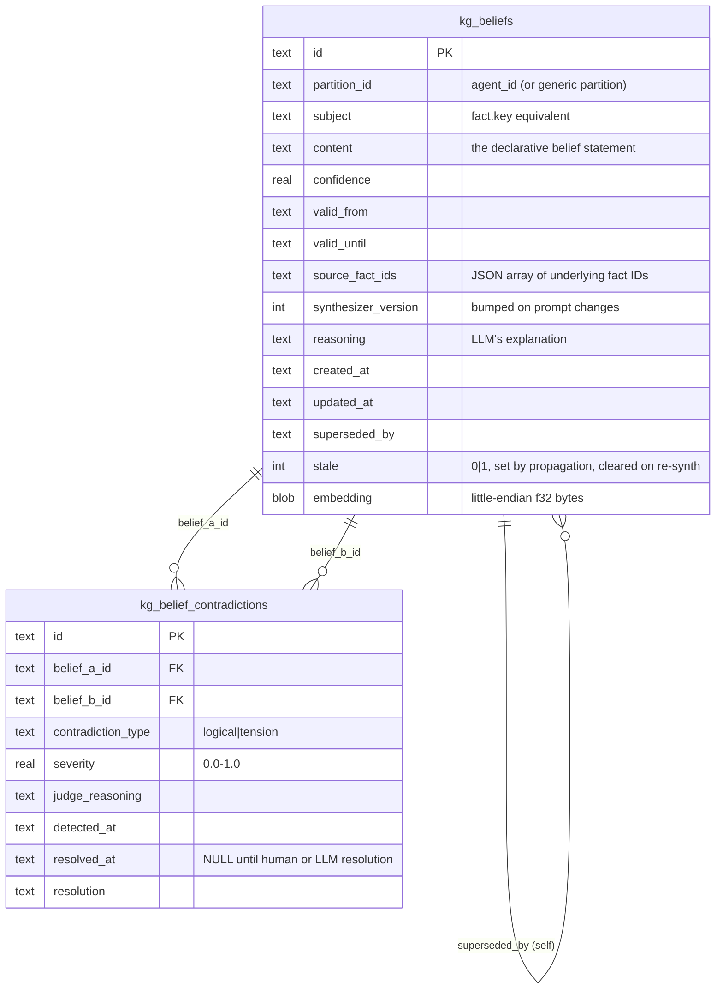

**Uniqueness:**
- `kg_beliefs`: `(partition_id, subject, valid_from)` — same subject at different valid_from = different rows
- `kg_belief_contradictions`: `(belief_a_id, belief_b_id)` — pair recorded once

### 3.4 Procedures (Layer 6)

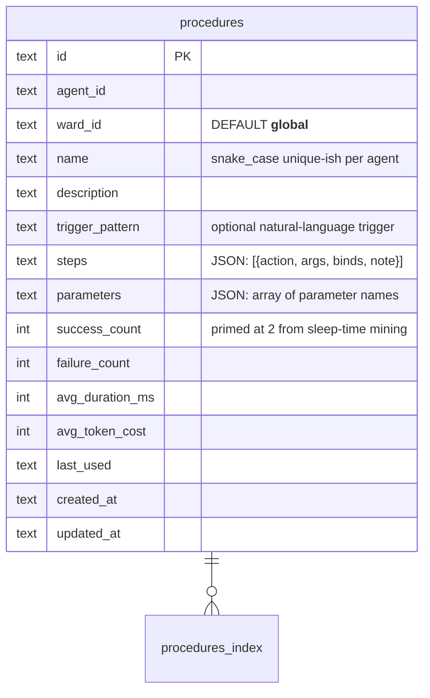

**Step format:**

```json
{
  "action": "shell",
  "args": { "command": "echo {{topic}}" },
  "binds": ["stdout"],
  "note": "human-readable description"
}
```

`{{step_N.field}}` and `{{parameter_name}}` interpolation supported.

### 3.5 Wiki articles (companion to KG)

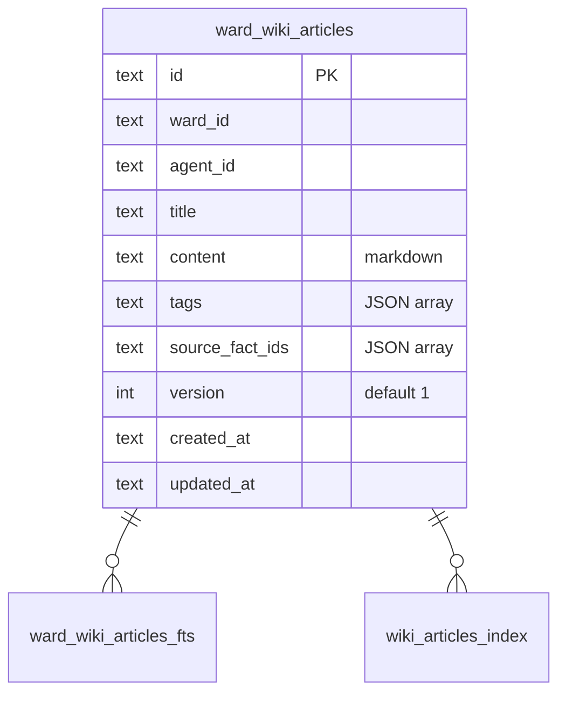

**Uniqueness:** `(ward_id, title)`. Companion to procedures — long-form domain knowledge per ward.

### 3.6 Vector ANN indexes

Five virtual-table indexes, all keyed by foreign-id, embedding column dimensioned at boot:

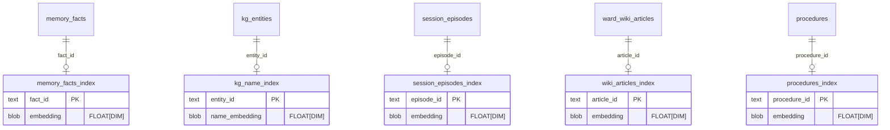

**Dimension reconciliation:** On boot, if the configured embedding model's dimension differs from the persisted `.embedding-state` marker, all five vector tables are dropped and recreated at the new dimension. A reindex pipeline repopulates them from source tables. (Data loss is intentional and recoverable; embeddings are best-effort.)

**Generic implementation:** Any vector store (pgvector, Pinecone, Qdrant, Weaviate, Vespa, Milvus, FAISS+RocksDB) works. The contract is: insert by foreign-id, ANN query by query-vector, delete-on-foreign-row-delete (via trigger or application-level cascade).

### 3.7 Recall audit + distillation health

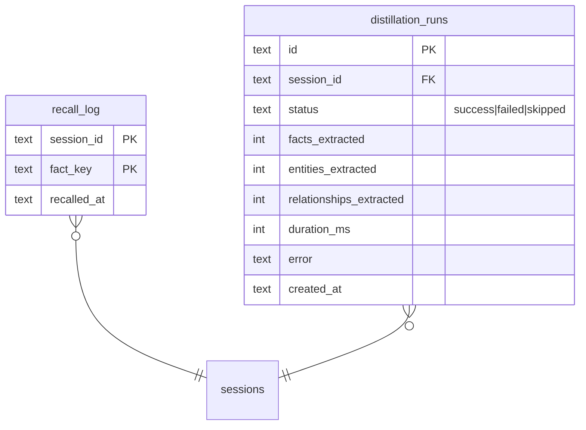

`recall_log` powers predictive recall (Layer 1 → Layer 7 feedback loop): facts that were recalled in sessions that ended in `success` get a boost on future queries.

### 3.8 Unified ER overview

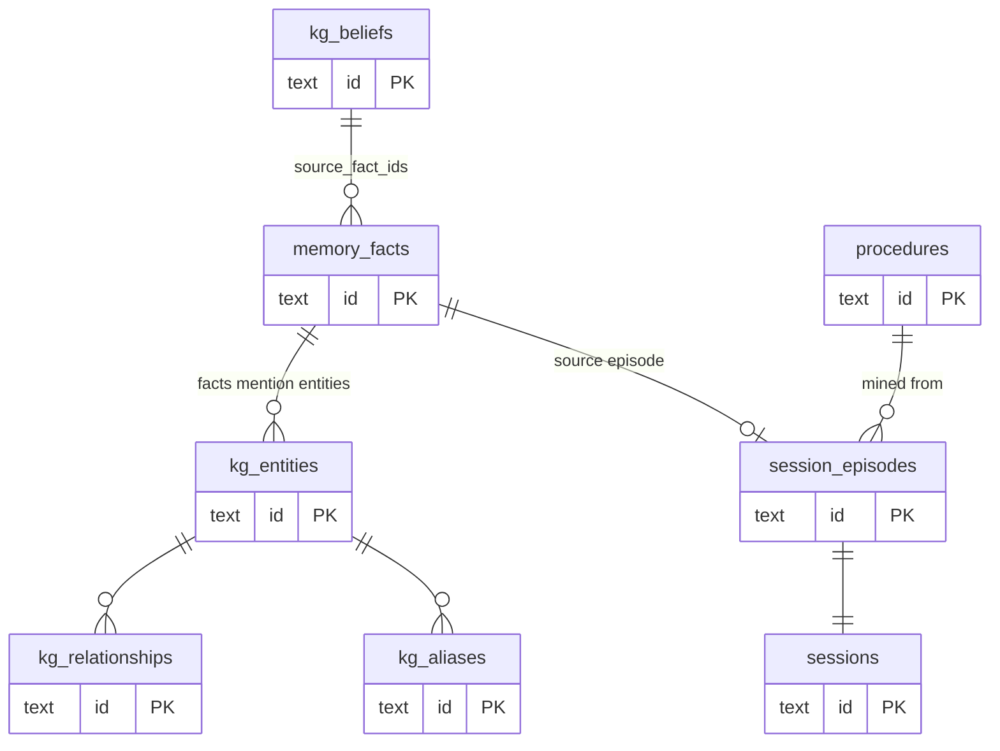

---

## 4. Layer 1 — Episodic & Atomic Facts

### 4.1 Purpose

Layer 1 is the **canonical store of what the agent has learned**. Every higher layer is derived from or indexes into Layer 1. A minimal MVP can ship Layer 1 alone and the agent will already remember things.

### 4.2 What "fact" means

A fact is a `(category, key, content, confidence)` quadruple bound to an agent and a scope. Categories describe the cognitive role; keys are stable handles for upsert; content is the actual prose.

**Canonical categories** (default category weights in §11.3):

| Category | Cognitive role | Example |
|--|--|--|
| `correction` | "NEVER do X / ALWAYS do Y" — the highest-priority rules | "Always use `git rebase`, never `git pull` on shared branches" |
| `schema` | A general principle abstracted from corrections | "Prefer non-destructive operations" |
| `belief` | A multi-fact synthesis (denormalised cache of Layer 5) | "User prefers terse code review" |
| `strategy` | A known-good approach to a recurring task | "When tests fail intermittently, replace timeouts with event waits" |
| `user` | User preference / context | "User is in Pacific timezone" |
| `instruction` | Standing direction from the user | "Don't open PRs without explicit ask" |
| `domain` | Domain-specific knowledge | "Project uses Axum + tokio" |
| `pattern` | A recurring observation that isn't yet a strategy | "Latency spikes correlate with deploy times" |
| `ward` | Knowledge scoped to a specific ward / project | "Ward `finance` requires SEC-EDGAR fetches" |
| `skill` | Reflective index of available skills (indexer-managed) | "skill:docx-writer available" |
| `agent` | Reflective index of subagents | "agent:researcher available" |
| `handoff` | End-of-session summary for next-session boot | (3-5 sentence summary) |

The category set is **extensible**; recall scoring assigns unknown categories the default weight of 1.0. Layer 7 promotes facts across categories (e.g. corrections → schemas).

### 4.3 Scope semantics

`scope` controls fact visibility:

- `agent` — only this agent sees it
- `global` — all agents under the same daemon see it (cross-agent shared knowledge)
- `ward` — only when the agent is operating in this ward

`ward_id` further scopes within a scope. The sentinel `__global__` means "no specific ward".

### 4.4 Bi-temporal columns

| Column | Meaning |
|--|--|
| `valid_from` | When this fact started being true (defaults to `created_at`) |
| `valid_until` | When this fact stopped being true (`NULL` = currently valid) |
| `superseded_by` | If non-null, points to the newer fact that replaced this one |
| `contradicted_by` | If non-null, points to a conflicting fact (Layer 5 may resolve later) |
| `epistemic_class` | `current` / `historical` / `hypothetical` — coarse-grained truth status |

See §6 for full bi-temporal mechanics.

### 4.5 Episodes

`session_episodes` is one row per completed session, summarising what happened. Fields:

- `task_summary` — what was attempted
- `outcome` — `success` / `partial` / `failure`
- `strategy_used` — short description of approach
- `key_learnings` — bullet list (LLM-generated)
- `token_cost` — for accounting + predictive scoring

Episodes are **uniqueness-keyed on `session_id`**, so re-running distillation is idempotent.

### 4.6 Recall audit (`recall_log`)

Every time a fact is recalled into a session's context, one row is written: `(session_id, fact_key, recalled_at)`. Powers two downstream features:

1. **Predictive recall** — facts recalled in successful sessions get scored higher in future similar queries
2. **Memory diff** — surfacing "what did the agent actually use this session" to the user

### 4.7 Archive (`memory_facts_archive`)

Bulk decay output. Facts that aged past their category half-life *and* dropped below a confidence floor are **copied** into `memory_facts_archive` and **deleted** from `memory_facts`. Archives are excluded from recall but preserved for audit and possible future restoration.

### 4.8 Lexical index

A keyword index over `key`, `content`, `category` is maintained for BM25-style retrieval. Concrete implementation in z-Bot: SQLite FTS5 contentless virtual table with sync triggers. Generic equivalent: any BM25 engine (Elasticsearch, OpenSearch, Tantivy, Bleve, Whoosh).

### 4.9 Vector index

An ANN index over an embedding of `content` (typically) is maintained alongside. Concrete implementation: sqlite-vec `vec0` virtual table. Generic: pgvector, Qdrant, Weaviate, FAISS+RocksDB, etc.

### 4.10 Why it matters

Without Layer 1, the agent forgets after every session. With it, the agent has correctable behaviour (corrections), preferences, and a history of episodic outcomes — already a meaningful improvement over a stateless agent.

### 4.11 Where it matters

- **Every memory loop** (see §12) reads Layer 1.
- **Distillation** writes to Layer 1 from session transcripts.
- **All higher layers** either index into or are derived from Layer 1.

---

## 5. Layer 2 — Knowledge Graph

### 5.1 Purpose

Atomic facts are unstructured text. The knowledge graph adds **structure**: real-world things and how they relate. This enables traversal-based recall ("what do I know about things connected to X?") and confidence propagation across related entities.

### 5.2 Entities

A `kg_entity` is a typed, named object. Required fields:

- `entity_type` — string discriminator (e.g. `person`, `repository`, `concept`, `tool`, `error`, `project`)
- `name` — canonical surface form
- `normalized_name` — lowercased + dedup-normalised
- `normalized_hash` — for fast dedup lookup (the de-facto uniqueness key)
- `agent_id` — scope

Lifecycle counters:

- `mention_count` — total times mentioned during distillation
- `access_count` — total recall hits
- `last_accessed_at` — for recency boost
- `first_seen_at`, `last_seen_at` — observation window

### 5.3 Relationships

`kg_relationships` is a directed, typed edge:

- `source_entity_id`, `target_entity_id` — endpoints
- `relationship_type` — string (e.g. `uses`, `depends_on`, `produces`, `member_of`)
- `properties` — JSON metadata
- `confidence` — `[0.0, 1.0]`

**Uniqueness constraint** `(source_entity_id, target_entity_id, relationship_type)` prevents duplicate edges; re-asserting bumps `mention_count`.

### 5.4 Aliases

`kg_aliases` maps surface forms to canonical entities. Multiple "GPT-4o", "gpt4o", "openai/gpt-4o" can all point to the same entity. Enables fuzzy entity resolution during distillation.

### 5.5 Causal edges

`kg_causal_edges` is a separate edge type for **cause → effect** observations distilled from session traces. Used by post-mortem analysis and as input to procedure mining.

### 5.6 Graph traversal

The standard recall path runs a **2-hop BFS** from seed entities (those matched by the initial keyword/vector query). Implementation: recursive CTE in SQL, or recursive query in a graph DB. Each hop applies `hop_decay` (default `0.6`) to expanded results.

```sql
-- Generic 2-hop expansion (SQL example, portable to any RDBMS with CTE support)
WITH RECURSIVE expansion(entity_id, hop, score) AS (
  SELECT id, 0, 1.0 FROM kg_entities WHERE id IN (:seed_entity_ids)
  UNION ALL
  SELECT
    CASE WHEN r.source_entity_id = e.entity_id THEN r.target_entity_id
         ELSE r.source_entity_id END,
    e.hop + 1,
    e.score * 0.6  -- hop_decay
  FROM expansion e
  JOIN kg_relationships r
    ON r.source_entity_id = e.entity_id OR r.target_entity_id = e.entity_id
  WHERE e.hop < 2
    AND r.confidence >= 0.1  -- min_kg_confidence filter
)
SELECT entity_id, MAX(score) AS score FROM expansion GROUP BY entity_id;
```

### 5.7 Bi-temporal on relationships

Relationships carry `valid_from` / `valid_until` columns. Two legacy columns (`valid_at`, `invalidated_at`) are kept for migration compat but the canonical pair is `valid_from` / `valid_until`. Point-in-time graph queries are possible (see §6).

### 5.8 Episodes (KG side)

`kg_episodes` is the **ingest queue** for the KG: each episode is a chunk of text to be processed (typically a session message or an external document). Status flow:

```
pending → processing → done
                    ↘ failed (with error + retry_count)
```

Distillation reads from this queue; multiple workers can pull concurrently.

### 5.9 Compactions audit

`kg_compactions` is the audit trail of every merge / supersession / prune the compactor performs. Used for debugging "where did this entity go?" and for undo.

### 5.10 Why it matters

- Recall finds connected context: querying "deployment" surfaces related entities like "rollback procedure," "monitoring dashboard," "on-call engineer."
- Decay can propagate: when an entity is invalidated, dependent relationships lose confidence (see §14).
- Hierarchy (Layer 4) is built on top of KG by clustering entities.
- Beliefs (Layer 5) can be subject-keyed by entity name.

### 5.11 Where it matters

- **Recall** — graph expansion is part of `recall_unified`.
- **Distillation** — produces entities and relationships from each session.
- **Compactor** (sleep-time) — dedupes near-duplicate entities (with pairwise verifier).
- **Hierarchy builder** — clusters entities to build summary layers.

---

## 6. Layer 3 — Bi-Temporal Semantics

### 6.1 Purpose

A fact may be **true now** (current) or **true historically** (e.g. "the user used to live in Seattle"). Conflating "when learned" with "when true" creates wrong recalls. Bi-temporal columns separate the two.

### 6.2 The two timelines

| Timeline | Column | Meaning |
|--|--|--|
| **Transaction time** | `created_at`, `updated_at` | When the system learned / recorded this |
| **Valid time** | `valid_from`, `valid_until` | When the fact was / is true in the real world |

A row may be created today (`created_at = 2026-05-24`) with `valid_from = 2020-01-01, valid_until = 2023-09-30` to encode "I just learned this, and it was true between these dates."

### 6.3 Currently-valid filter

The default recall query applies:

```sql
WHERE (valid_until IS NULL OR valid_until > :now)
  AND (valid_from IS NULL OR valid_from <= :now)
```

### 6.4 Point-in-time recall

The recall API accepts an optional `as_of: DateTime`. When provided:

```sql
WHERE (valid_until IS NULL OR valid_until > :as_of)
  AND (valid_from IS NULL OR valid_from <= :as_of)
```

This lets the agent answer "what did I believe about X six months ago?" — useful for retrospective audits and for human-in-the-loop debugging.

### 6.5 Supersession

When the conflict resolver (or distillation) decides fact A is superseded by fact B:

```
B.valid_from := now() (or distilled timestamp)
A.valid_until := B.valid_from   -- closes A's truth interval
A.superseded_by := B.id          -- chain for traceability
```

Supersession is **non-destructive**: A is not deleted; its truth-interval is just closed. Recall ignores A by default, but `as_of < B.valid_from` queries still return it.

### 6.6 Contradiction (different from supersession)

`contradicted_by` is a softer flag: it means "another fact claims something incompatible, but I haven't decided which is true." Recall applies a `contradiction_penalty` (default `0.7×`) without removing either. The conflict resolver and belief-contradiction detector eventually convert contradictions into supersessions or document them as compatible.

### 6.7 Epistemic class

`epistemic_class` is a coarse 3-way tag:

| Value | Meaning |
|--|--|
| `current` | The default; the system holds this as true now |
| `historical` | True in the past but the system has explicit evidence it's no longer true |
| `hypothetical` | A possibility being considered, not yet confirmed |

Layer 7 stages set this when supersession or hypothesis-generation occurs.

### 6.8 Why it matters

- **Correct recall** — without `valid_until`, the agent will tell you "Bob works at Acme" forever even after Bob quit.
- **Audits** — humans can ask "what did the agent believe last Tuesday?"
- **Conflict-aware reasoning** — the system can present alternatives ranked by confidence rather than overwriting silently.
- **Reversibility** — supersession is undoable; deletion is not.

### 6.9 Where it matters

- **Recall** filter (always).
- **Conflict resolver** (sleep-time) — writes supersessions.
- **Distillation** — sets `valid_from`, optionally `valid_until` if the source text indicates an end date.
- **Belief synthesis** — recency-weights by `valid_from`.

---

## 7. Layer 4 — Hierarchical Memory (LeanRAG)

### 7.1 Purpose

The knowledge graph grows linearly. As it crosses ~1k entities, flat traversal degrades — too many neighbours per hop, too much noise. **Hierarchical memory** builds a tree of cluster aggregates over the KG, so recall can navigate from broad concepts down to leaves rather than wandering across an unstructured graph.

This is the architecture commonly known as **LeanRAG** / **HiRAG** in the literature.

### 7.2 The layer column

Both `kg_entities` and `kg_relationships` carry a `layer INTEGER NOT NULL DEFAULT 0` column:

- `layer = 0` — actual ground-truth entities and edges (the underlying KG)
- `layer = 1` — clusters of layer-0 entities, plus the aggregate edges between them
- `layer = 2` — clusters of layer-1 clusters
- ... up to `max_layers` (default 4)

`parent_cluster_id` (on entities) points up one level.

### 7.3 Builder algorithm

For each layer `N` until done:

1. **Fetch** all `layer = N` entities + embeddings.
2. **K-means cluster** the embeddings (cosine distance) into roughly `cluster_target_size`-sized groups (default 20).
3. **Stop condition** — if cluster sparsity is too high (every entity in its own cluster), stop layering.
4. **Aggregate each cluster** via LLM call:
   - Input: cluster members' names + descriptions
   - Output: `{ name: "2-5 word concept", description: "≤25 words explaining what this cluster IS" }`
   - Singletons short-circuit (no LLM call; just promote the single member)
5. **Write** aggregate as a new `layer = N+1` entity, with `parent_cluster_id` set on each member.
6. **Synthesise inter-cluster relations**:
   - For each pair of layer-`N+1` aggregates A, B, compute λ = number of underlying layer-N relationships crossing A↔B
   - If λ > `inter_cluster_relation_threshold` (default 3), LLM-synthesise a relation type via a separate call
   - Write the new edge with `layer = N+1, is_inter_cluster = 1`
7. **Repeat** for `N+1` until `max_layers` reached or stop condition met.

### 7.4 LCA-bounded recall

Standard recall returns top-K from the union of all layers. **LCA-bounded recall** uses the cluster tree to constrain the search:

1. Compute initial seed entities (from FTS + vector at layer 0).
2. Find the **lowest common ancestor cluster** (LCA) of the seeds in the cluster tree.
3. Limit graph traversal to descendants of the LCA cluster (and the LCA's neighbours via inter-cluster edges).
4. Surface inter-cluster relations as a **separate result band** so the agent sees "this is connected to OTHER concepts: X, Y" without those leaking into the primary results.

This produces tighter, more topical recall on large graphs.

### 7.5 Configuration

| Setting | Default | Meaning |
|--|--|--|
| `cluster_target_size` | 20 | Aim for clusters of this size |
| `max_layers` | 4 | Stop after this many levels above leaves |
| `sparsity_epsilon` | (small) | If too many singletons, stop |
| `inter_cluster_relation_threshold` | 3 | Min co-mentions before synthesising aggregate edge |
| `llm_budget_per_cycle` | 50 | Cap LLM calls per sleep-time cycle |
| `seed` | constant | Deterministic clustering |

Hierarchy is **opt-in** via `MemorySettings.hierarchy.enabled` — disabled by default.

### 7.6 Why it matters

- **Scales recall** beyond a few thousand entities.
- **Reduces noise** by topical bounding.
- **Surfaces emergent concepts** — the cluster aggregate names ARE concept discovery.
- **Enables cross-concept navigation** via inter-cluster edges (a separate result band).

### 7.7 Where it matters

- **Recall** — when enabled, `recall_unified` includes `HierEntity` and `HierRelation` item kinds.
- **Hierarchy Builder** — runs in the sleep-time pipeline after Compactor.
- **Visualisation** — 3D knowledge viz can render layers as shells.

---

## 8. Layer 5 — Belief Network

### 8.1 Purpose

Atomic facts may contradict, repeat, or be partially overlapping. A **belief** is the system's **current synthesised position** on a subject, derived from multiple constituent facts. Beliefs add:

- A single answer per subject (rather than 7 noisy facts)
- Confidence propagation (recency-weighted average across constituents)
- A **contradiction graph** between beliefs that the system can reason over

### 8.2 Belief shape

```typescript
interface Belief {
  id: string;
  partition_id: string;          // typically agent_id (generic for multi-tenancy)
  subject: string;               // the canonical key (e.g. fact.key)
  content: string;               // ONE declarative sentence
  confidence: number;            // 0..1, recency-weighted across constituents
  valid_from: DateTime | null;
  valid_until: DateTime | null;
  source_fact_ids: string[];     // facts this belief is derived from
  synthesizer_version: number;   // bumped on prompt changes (triggers re-synth)
  reasoning: string | null;      // LLM's explanation (null on short-circuit)
  created_at: DateTime;
  updated_at: DateTime;
  superseded_by: string | null;
  stale: boolean;                // marked by propagation, cleared on re-synth
  embedding: Vec<f32> | null;    // best-effort
}
```

**Upsert key:** `(partition_id, subject, valid_from)`. Same subject at different `valid_from` = different rows (truth history).

### 8.3 Synthesis algorithm

For each `(partition_id, subject)` group with multiple facts:

- **Short-circuit (1 fact):** copy the fact verbatim, no LLM call.
- **Multi-fact:** LLM call:
  - Prompt: "Synthesise one declarative belief from these facts. Newer beats older; consensus reinforces."
  - Temperature: `0.0`, max tokens: `256`
  - Response: `{ content, reasoning }`
- **Confidence:** `avg(fact.confidence × recency_weight(fact.valid_from))` where `recency_weight = 1 / (1 + age_days / 90)`.
- **Failure mode:** if LLM fails, fall back to most-recent fact verbatim; `reasoning = null`.

### 8.4 Stale marker

When the conflict resolver supersedes a fact that's a `source_fact_ids` member of a belief, the belief's `stale` column is set to `1`. The next belief-synthesis pass picks up stale beliefs first, re-synthesises, and clears the marker. This is **propagation**: belief health follows fact health.

### 8.5 Contradiction graph

A separate `kg_belief_contradictions` table records pairwise belief conflicts:

```typescript
interface BeliefContradiction {
  id: string;
  belief_a_id: string;
  belief_b_id: string;
  contradiction_type: 'logical' | 'tension';
  severity: number;              // 0..1
  judge_reasoning: string | null;
  detected_at: DateTime;
  resolved_at: DateTime | null;
  resolution: string | null;
}
```

Classification:

| Type | Meaning |
|--|--|
| `logical` | A and B cannot both be true (mutually exclusive) |
| `tension` | Different facets of the same subject; could both be true with context |
| `compatible` | (not stored) — about different things, or fully consistent |
| `duplicate` | (not stored) — same meaning, different key naming |

### 8.6 Detection algorithm

For each agent's active (non-superseded) belief set:

1. Group beliefs by subject-prefix neighbourhood (depth 1 by default — same prefix word, e.g. all beliefs about "deployment").
2. For each pair within a neighbourhood not already in `kg_belief_contradictions`:
   - LLM call: `{ decision, severity, reasoning }`
   - Temperature: `0.0`, max tokens: `256`
3. Write row only when `decision ∈ {logical, tension}`.
4. Budget-cap LLM calls per cycle (default 20).

### 8.7 Recall integration

Beliefs are recall-able as `ScoredItem { kind: Belief, ... }` alongside facts, with their own default category weight of `1.5` (high — beliefs are pre-synthesised). Future enhancement: surface unresolved contradictions to the agent as a warning band.

### 8.8 Why it matters

- **Denoises recall** — one belief beats five repetitive facts.
- **Confidence propagation** — when underlying facts decay or supersede, beliefs update automatically (via `stale` flag).
- **Explicit contradiction handling** — the system has a place to say "these two things conflict" rather than letting recall surface both as equals.
- **Long-term coherence** — beliefs accumulate the system's "current best understanding" across many sessions.

### 8.9 Where it matters

- **Belief Synthesiser** (sleep-time stage) — writes beliefs.
- **Belief Contradiction Detector** (sleep-time stage) — writes contradictions.
- **Recall** — surfaces beliefs.
- **Conflict Resolver** (Layer 7) — fires belief propagation when superseding facts.

---

## 9. Layer 6 — Procedures

### 9.1 Purpose

Some tasks are sequential procedures: "fetch X, transform Y, call Z." When the agent figures out a working sequence, **storing it as a procedure** (replayable runbook) lets future invocations skip rediscovery.

### 9.2 Procedure shape

```typescript
interface Procedure {
  id: string;
  agent_id: string;
  ward_id: string;                       // default '__global__'
  name: string;                          // snake_case unique-ish per agent
  description: string;
  trigger_pattern: string | null;        // natural-language trigger hint
  steps: ProcedureStep[];
  parameters: string[];                  // top-level parameter names
  success_count: number;                 // primed at 2 from sleep-time mining
  failure_count: number;
  avg_duration_ms: number | null;
  avg_token_cost: number | null;
  last_used: DateTime | null;
  created_at: DateTime;
  updated_at: DateTime;
}

interface ProcedureStep {
  action: string;                                  // must be a registered tool name
  args: Record<string, unknown>;                   // tool args, may contain {{interpolations}}
  binds: string[];                                 // field names to extract from result for later interpolation
  note: string | null;                             // human-readable description
  agent?: string;                                  // optional: which subagent runs this step
  task_template?: string;                          // optional: for delegate_task style steps
}
```

### 9.3 Interpolation

Two interpolation forms:

- `{{step_N.field}}` — value from step N's result, specified field
- `{{parameter_name}}` — value supplied at procedure dispatch

Example:

```json
{
  "name": "fetch_and_summarise",
  "description": "Fetch a URL and produce a summary",
  "parameters": ["url"],
  "steps": [
    {
      "action": "shell",
      "args": { "command": "curl -sS {{url}}" },
      "binds": ["stdout"],
      "note": "Fetch the page"
    },
    {
      "action": "llm_summarise",
      "args": { "text": "{{step_0.stdout}}", "max_words": 100 },
      "binds": ["summary"],
      "note": "Summarise the fetched page"
    }
  ]
}
```

### 9.4 Mining (sleep-time)

The **Pattern Extractor** mines procedures from successful session transcripts:

1. Find pairs of successful sessions (cosine similarity ≥ 0.82 on task-summary embeddings) that share a tool-call prefix of length ≥ 3.
2. LLM call: generalise the prefix into a parameterised procedure.
3. Validate every step's `action` is in the tool whitelist; sanitise the `name` to snake_case.
4. Insert with `success_count = 2` (primed by evidence of 2 successful sessions).

Budget-capped: ~5 LLM calls per cycle.

### 9.5 Dispatch (`run_procedure` tool)

The agent has a `run_procedure(name, params)` tool that:

1. Looks up the procedure by `(agent_id, name)`.
2. Iterates `steps` in order, dispatching each via the tool registry.
3. After each step, extracts `binds` fields from the result into a context map.
4. Substitutes `{{step_N.field}}` and `{{parameter_name}}` in subsequent steps.
5. On any step failure: increments `failure_count`, surfaces the error.
6. On full success: increments `success_count`, updates `avg_duration_ms` / `avg_token_cost`.

### 9.6 Vector index

Procedures are embedded (description + name) and indexed in `procedures_index`. Recall can suggest "you have a procedure for this" when the query matches.

### 9.7 Why it matters

- **Skip rediscovery** — replay proven sequences instead of re-planning.
- **Token efficiency** — a procedure dispatch is cheaper than a full plan cycle.
- **Observable success/failure rates** — `success_count` / `failure_count` give the agent confidence-to-replay.
- **Compositional** — a procedure step can be `run_procedure` itself, enabling layered automation.

### 9.8 Where it matters

- **Pattern Extractor** (sleep-time) — writes new procedures.
- **Recall** — surfaces procedure matches in `recall_unified`.
- **`run_procedure` tool** — dispatched by the agent.
- **Distillation** can also write procedures when the user explicitly says "remember how to do this."

---

## 10. Layer 7 — Reflective Synthesis (Sleep-Time Pipeline)

### 10.1 Purpose

Layers 1-6 store and retrieve. Layer 7 **improves them over time**. The reflective pipeline is a background worker that runs on an interval (or on demand) and walks through a fixed sequence of cleanup, abstraction, synthesis, and decay stages.

The pipeline is **conservative by design**:

- Every stage may fail independently; failures are logged at WARN and the cycle continues.
- All stages are idempotent: re-running on the same state produces the same output.
- Decisions that affect correctness (e.g. entity merge) default to deny on LLM failure.

### 10.2 Trigger

Two trigger paths, both invoke the same `run_cycle()` orchestrator:

1. **Scheduled** — periodic interval (default 60 minutes). Implementation: timer / cron / async interval, depending on runtime.
2. **On-demand** — HTTP endpoint or admin trigger. The orchestrator exposes a non-blocking signal.

Cycles are tagged `"scheduled"` or `"on-demand"` in logs and cycle stats.

### 10.3 Stage order (dependency graph)

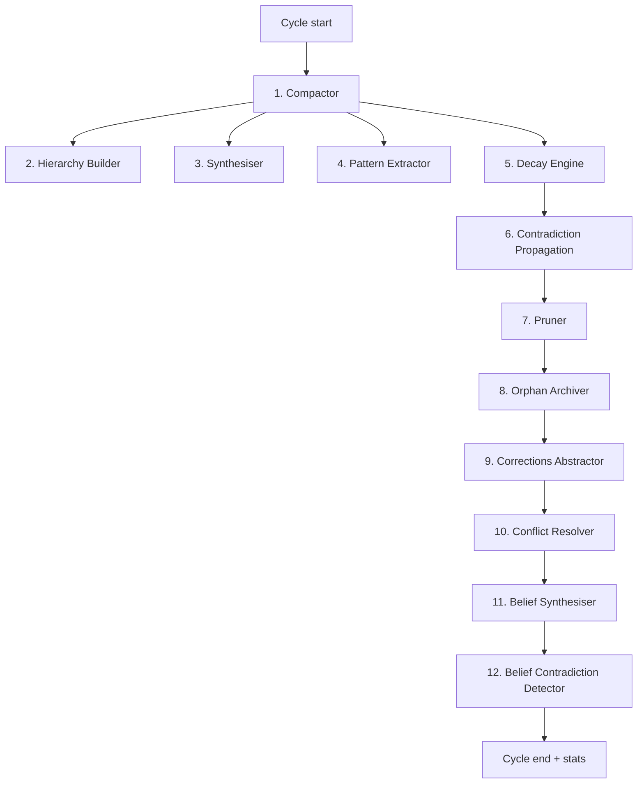

Hard dependencies:

- **Compactor must run first** — produces clean post-dedup state for downstream stages.
- **Corrections Abstractor before Conflict Resolver** — so newly-promoted schemas can be considered for conflicts.
- **Belief Synthesiser before Belief Contradiction Detector** — so fresh beliefs are visible to detection.
- **Decay before Pruner** — pruner removes what decay flagged.

Independent stages (Synthesiser, Pattern Extractor, Decay) can run in any order or in parallel.

### 10.4 Stage 1 — Compactor (entity merge)

**What:** Dedupes near-duplicate entities. For each entity pair with cosine similarity ≥ threshold, optionally invokes a **pairwise verifier** (LLM adjudicator) before merging.

**Pairwise verifier:**

- Prompt: "Are these two entities the same real-world thing? Return `{same_entity: bool, confidence: 0-1}`."
- Temperature: `0.0`, max tokens: `128`
- **Failure mode: default deny.** Any LLM error, parse failure, or client build failure returns `false`. Flaky networks never trigger incorrect merges.

**Writes:** Updates `kg_entities` (merged entity absorbs the other, records `compressed_into`), `kg_relationships` (rewires edges to surviving entity), `kg_compactions` (audit).

### 10.5 Stage 2 — Hierarchy Builder

See [§7.3](#73-builder-algorithm). Two LLM call types:

- **Aggregate client** — synthesise cluster name + description (temperature 0.0, max tokens 256)
- **Relation client** — synthesise inter-cluster relation type (temperature 0.0, max tokens 64)

**Failure mode:** soft. Aggregate failure → cluster skipped. Relation failure → falls back to `"related-via"` default.

### 10.6 Stage 3 — Synthesiser (cross-session strategy extraction)

**What:** Finds entities that appear in 2+ distinct sessions in the last 30 days. For each, asks an LLM: "Does the repeated co-occurrence reveal a reusable strategy worth memorising?"

**Reads:** `kg_entities` (strategy candidates), `session_episodes` (task summaries), `kg_relationships` (related entity context).

**Writes:** New `memory_facts` rows with `category = 'strategy'`. If a similar strategy fact already exists (cosine ≥ 0.88), bumps `mention_count` and merges episode IDs instead of inserting.

**Prompt:** "Return `{strategy, confidence, key_fact, decision: synthesize | skip}`." Temperature 0.0, max tokens 512. Skip if confidence < 0.7 or decision = skip.

**Budget:** ~10 LLM calls per cycle.

### 10.7 Stage 4 — Pattern Extractor

See [§9.4](#94-mining-sleep-time). Mines parameterised procedures from successful session pairs.

### 10.8 Stage 5 — Decay Engine

**What:** Reduces confidence on entities/relationships/facts that haven't been accessed recently.

**Formula (default):**

```
new_confidence = old_confidence × (1 / (1 + age_days / half_life_days))
```

Per-type half-lives:

- KG entities: 90 days
- KG relationships: 90 days
- Memory facts: per-category (see §14)

**Skip clause:** entities/relationships updated in the last `skip_recent_hours` (default 24) are skipped.

**Confidence floor:** `min_confidence` (default 0.01). Below this, rows are flagged for archival.

### 10.9 Stage 6 — Contradiction Propagation

**What:** When a fact's confidence drops below `fact_confidence_drop_threshold` (default 0.3), propagate the drop to:

- Related KG entities (via `source_episode_ids` cross-referencing)
- Beliefs that include the fact in their `source_fact_ids` (mark `stale = 1`)

This is the inter-layer health link: decay in Layer 1 ripples into Layers 2 and 5.

### 10.10 Stage 7 — Pruner

**What:** Removes entities/relationships/facts flagged by decay (below `min_confidence` floor, no recent access).

**Conservative:** copies removed rows to archive tables before delete. Pruning is observable via cycle stats and can be undone from the audit log.

### 10.11 Stage 8 — Orphan Archiver

**What:** Optional pass that finds and archives entities with zero relationships AND zero recall hits in the last N days.

### 10.12 Stage 9 — Corrections Abstractor

**What:** When ≥ 3 correction facts exist, ask an LLM: "Do these share a common theme expressible as one imperative principle?"

**Prompt:** Returns `{schema, confidence, key_fact, decision: abstract | skip}`. Temperature 0.0, max tokens 512. Skip threshold: 0.7 confidence.

**Writes:** New fact with `category = 'schema'`, key `schema.corrections.{short_hash(key_fact)}`. The original corrections remain — schemas are an *additional* layer of higher-priority guidance, not a replacement.

**Why:** turns "don't use bare except, don't catch broad exceptions, log specific errors" into "schema: prefer specific exception handling." The schema scores higher in recall (category weight 1.6 vs correction 1.5).

### 10.13 Stage 10 — Conflict Resolver

**What:** Pairwise compares schema facts for contradictions. For each pair with cosine ≥ 0.85:

- LLM call: `{decision: contradicts | compatible, confidence, reason}`. Temperature 0.0, max tokens 256.
- If `decision == 'contradicts'` and confidence ≥ 0.7:
  - **Supersede** the older fact (set `valid_until = winner.created_at`, `superseded_by = winner.id`).
  - **Propagate** to beliefs (mark `stale` on beliefs that included the loser).
- Budget: ~10 LLM calls per cycle.

### 10.14 Stage 11 — Belief Synthesiser

See [§8.3](#83-synthesis-algorithm). Opt-in via config flag. Reads facts grouped by `(agent_id, key)`, synthesises a belief per group, upserts to `kg_beliefs`.

### 10.15 Stage 12 — Belief Contradiction Detector

See [§8.6](#86-detection-algorithm). Opt-in. Pairwise judges beliefs in subject-prefix neighbourhoods, writes contradictions to `kg_belief_contradictions`.

### 10.16 Side stage — Handoff Writer (per-session, not per-cycle)

**What:** Runs **after a session completes**, not during a sleep cycle. Summarises the last ~50 messages into a 3-5 sentence handoff entry. Written to `memory_facts` with sentinel `agent_id = '__handoff__'` and category `handoff`.

**Prompt:** "Summarise this conversation. Cover what was accomplished, what's incomplete, what the user seemed focused on next. Use past tense. Write for the agent reading this at the start of the next session." Temperature **0.2** (only stage with non-zero temp, for fluency), max tokens 256.

**Injection point:** Read at next-session boot via `read_handoff_block(fact_store, current_ward)` — returns a formatted markdown block injected into the bootstrap system message.

**Stale guard:** entries older than 7 days are skipped. Ward filter ensures handoffs only fire for the active ward.

### 10.17 Cycle stats

After every cycle, the orchestrator logs a structured stats object:

```typescript
interface CycleStats {
  candidates_considered: number;             // Compactor
  merges_performed: number;                  // Compactor
  synthesis_facts_inserted: number;          // Synthesiser
  synthesis_facts_bumped: number;            // Synthesiser
  patterns_inserted: number;                 // Pattern Extractor
  schemas_abstracted: number;                // Corrections Abstractor
  conflicts_resolved: number;                // Conflict Resolver
  prune_candidates: number;                  // Decay Engine
  pruned: number;                            // Pruner
  orphans_archived: number;                  // Orphan Archiver
  kg_entities_decayed: number;               // Decay Engine
  kg_relationships_decayed: number;          // Decay Engine
  contradiction_episodes_processed: number;
  beliefs_synthesized: number;               // Belief Synthesiser
  belief_contradictions_detected: number;    // Belief Contradiction Detector
  hierarchy_aggregates_created: number;      // Hierarchy Builder
  hierarchy_inter_cluster_relations: number;
  // ... extensible
}
```

### 10.18 LLM routing for reflection

All Layer-7 LLM calls flow through a `MemoryLlmFactory` with an optional task tag. A production deployment routes Layer 7 to a cheaper / faster model than the orchestrator (e.g. Haiku for nightly synthesis, while orchestrator runs Opus). See §15.4.

### 10.19 Why it matters

Without Layer 7, the system accumulates noise: duplicate entities, redundant corrections, conflicting beliefs, stale relationships. Layer 7 is the **self-healing loop** that keeps memory coherent over months and years of operation.

### 10.20 Where it matters

The pipeline is the **lifetime maintenance system**. Without it, every other layer accumulates entropy. With it:

- Knowledge graph stays deduped (Compactor)
- Recall stays relevant (Decay + Pruner)
- Corrections sharpen into principles (Schema promotion)
- Conflicting knowledge gets resolved (Conflict Resolver + Belief Contradiction Detector)
- Successful patterns become replayable runbooks (Pattern Extractor)
- The graph develops topological structure (Hierarchy Builder)

---

## 11. Recall Engine

### 11.1 The unified recall API

A single entry point returns mixed-type scored items:

```typescript
interface RecallEngine {
  recall_unified(
    agent_id: string,
    query: string,
    ward_id: string | null,
    active_goals: GoalLite[],
    budget: number,
    as_of?: DateTime,                // optional point-in-time
  ): Promise<ScoredItem[]>;
}

interface ScoredItem {
  kind: 'fact' | 'wiki' | 'procedure' | 'graph_node'
      | 'goal' | 'episode' | 'belief'
      | 'hier_entity' | 'hier_relation';
  id: string;
  content: string;
  score: number;
  provenance: Provenance;
}

interface Provenance {
  source: string;                    // table or layer name
  source_id: string;
  session_id?: string;
  ward_id?: string;
}
```

### 11.2 Hybrid retrieval — Reciprocal Rank Fusion (RRF)

**Note this is a deliberate departure from naive weighted fusion.** The conceptual formula `0.7 × vector + 0.3 × bm25` is widely cited, but rank-based fusion (RRF) is more robust to score-scale mismatches between vector and lexical engines.

**Algorithm:**

1. Run lexical (BM25) query → top `K_retrieval = 3 × budget` results, ranked.
2. Run vector ANN query → top `K_retrieval` results, ranked.
3. For each result in each list, compute RRF contribution: `1 / (RRF_K + rank)` where `RRF_K = 60`, `rank` is 1-based position in that list.
4. Sum contributions per item across both lists. Items appearing in both get higher base scores; classify as `"hybrid"`, vs `"fts"` or `"vec"` only.
5. Pass to priority engine for multipliers.

```python
# Pseudocode
RRF_K = 60
K_retrieval = 3 * budget
score_map = {}                       # item_id -> (rrf_score, item, source)

for rank, item in enumerate(fts_results, start=1):
    score_map[item.id] = (1 / (RRF_K + rank), item, 'fts')

for rank, item in enumerate(vec_results, start=1):
    rrf = 1 / (RRF_K + rank)
    if item.id in score_map:
        prev_rrf, _, _ = score_map[item.id]
        score_map[item.id] = (prev_rrf + rrf, item, 'hybrid')
    else:
        score_map[item.id] = (rrf, item, 'vec')
```

### 11.3 Priority engine (9 multipliers)

After RRF fusion, each item's score is multiplied by:

```
final_score = rrf_score
            × category_weight             # see table below
            × ward_affinity               # 1.3× if matches current ward
            × temporal_decay              # 1 / (1 + age_days / half_life)
            × mention_boost               # 1 + log2(mention_count)
            × contradiction_penalty       # 0.7× if contradicted_by IS NOT NULL
            × supersession_penalty        # class-aware: 0.0 if epistemic=historical
            × entity_confidence           # for graph-ANN path: filter < 0.1
            × predictive_boost            # 1.3× if recalled in past successful sessions (when enabled)
```

**Default category weights** (from canonical implementation):

| Category | Weight |
|--|--|
| `schema` | 1.6 |
| `belief` | 1.5 |
| `correction` | 1.5 |
| `strategy` | 1.4 |
| `user` | 1.3 |
| `instruction` | 1.2 |
| `domain` | 1.0 |
| `pattern` | 0.9 |
| `ward` | 0.8 |
| `skill` | 0.7 |
| `agent` | 0.7 |
| (unknown) | 1.0 |

### 11.4 Temporal decay

```
decay(last_seen, half_life_days) = 1 / (1 + max(age_days, 0) / half_life_days)
```

Per-category half-lives:

| Category | Half-life (days) |
|--|--|
| `user` | 180 |
| `instruction` | 120 |
| `correction` | 90 |
| `strategy` | 60 |
| `pattern` | 45 |
| `domain` | 30 |
| (default) | 30 |

`skill` and `agent` categories skip decay (they are indexer-managed and should always reflect current registry state).

### 11.5 Ward affinity

If `ward_id` is provided and not `"scratch"`:

- Facts with `key` starting with `{ward}/` get `1.3×`
- Facts with `category == 'ward'` get `1.3×`

### 11.6 Mention boost

```
mention_boost = 1 + log2(max(mention_count, 1))
```

Frequently-mentioned facts get a sublinear lift.

### 11.7 Contradiction penalty

```
if fact.contradicted_by is not NULL:
    score *= 0.7
```

Soft penalty — the agent still sees the fact but ranked lower.

### 11.8 Class-aware supersession penalty

| `epistemic_class` | Multiplier |
|--|--|
| `current` | 1.0 |
| `historical` | 0.0 (drop entirely, unless `as_of` queries past) |
| `hypothetical` | 0.5 |

### 11.9 Predictive boost (optional, requires `recall_log` analysis)

When enabled:

- Look up the last K episodes with similar task summaries (cosine match)
- For each fact that was recalled during a session with `outcome = success`, apply `1.3×`

Status in reference implementation: configured but not yet wired (Phase 5 work).

### 11.10 Graph expansion

In parallel with FTS+vector retrieval, the recall engine runs a 2-hop expansion from seed entities mentioned in initial results. See [§5.6](#56-graph-traversal). Entities with confidence < `min_kg_confidence` (default 0.1) are filtered out before scoring.

### 11.11 Hierarchy band

When hierarchy is enabled, recall additionally:

- Maps seed entities to their layer-N+1 cluster
- Finds the LCA cluster of the seeds
- Walks down from the LCA to surface cluster-internal entities
- Surfaces **inter-cluster relations as a separate band** so the agent sees "this is connected to these OTHER concepts" without those leaking into the primary result list

### 11.12 Belief injection

Beliefs matching the query subject are retrieved from `kg_beliefs` and added to results with `kind: 'belief'`. Default category weight 1.5.

### 11.13 Procedure injection

Procedures matching the query (semantic on description + exact-name) are surfaced with `kind: 'procedure'`. The agent can dispatch immediately via `run_procedure`.

### 11.14 Truncation

Final results are sorted by `final_score` descending, truncated to `budget`. Items below `min_score` (default 0.3) are dropped.

### 11.15 Output formatting

`format_scored_items(items)` produces a single system-message-style block:

```
## Recall
### Rules (ALWAYS / NEVER)
- (correction) Always use `git rebase` on shared branches
### Warnings (avoid these approaches)
- (failed-episode) Last time we tried X, it produced Y bug
### Beliefs
- User prefers terse code review
### Past experiences
- (episode #sess-abc, success) Implemented similar feature using strategy Z
### Related concepts
- (graph) deployment → rollback procedure → on-call rotation
### Procedures available
- run_procedure(name="fetch_and_summarise", params=["url"])
```

This block is injected as a system message at the loop's defined integration point (see §12).

---

## 12. The Six Memory Loops

### 12.1 Loop summary

| # | Loop | When | Reads | Injects into |
|--|--|--|--|--|
| 1 | System recall | First user message of a session | Full recall_unified | System message at index 0 |
| 2 | Intent + memory | Before intent-analysis LLM call | recall_unified with `agent_id='root'` | Intent classifier prompt |
| 3 | Subagent priming | At delegation spawn | recall_unified with child agent + ward | Subagent's initial history |
| 4 | Mid-session refresh | Every N turns during long sessions | recall_unified, novelty-filtered | Working-memory middleware |
| 5 | Post-session distillation | Session end | Full session transcript | Writes — extracts facts/entities/episodes |
| 6 | Sleep-time pipeline | Background interval or on-demand | All memory tables | Writes — see §10 |

### 12.2 Loop 1 — System recall (session boot)

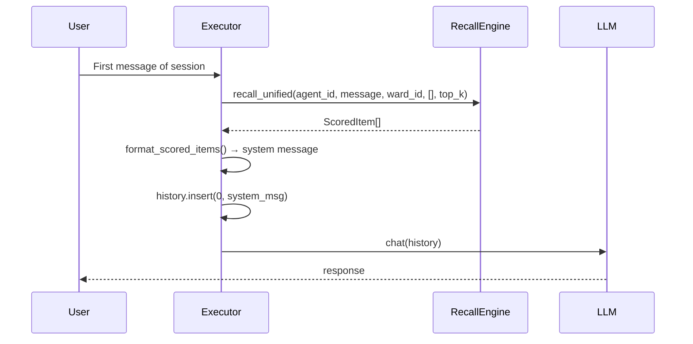

`top_k`: 5 (chat mode), 10 (research mode).

### 12.3 Loop 2 — Intent + memory

Before the intent-analysis classifier (which routes the user's request to a ward or agent), the recall engine fetches context using `agent_id = 'root'` (because at intent time, the actual agent hasn't been chosen yet):

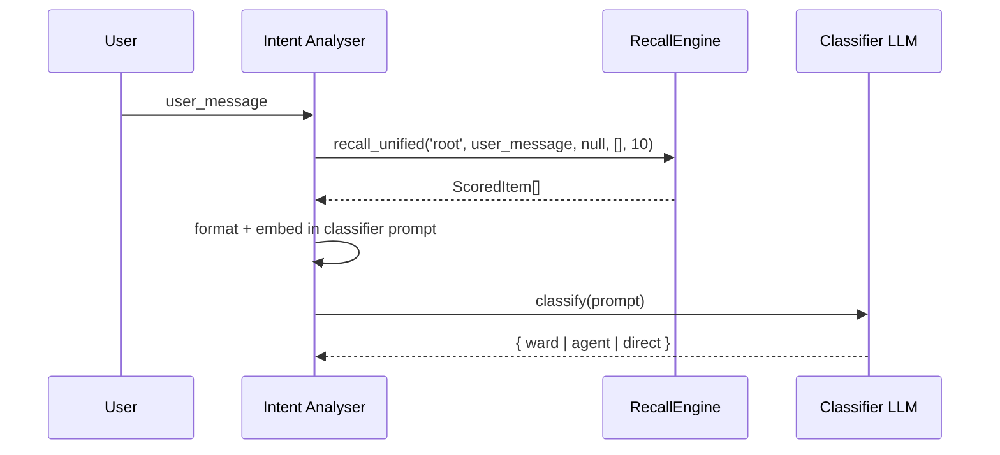

`top_k = 10`. Inherited orchestrator settings unless intent-analysis-specific LLM config is set.

### 12.4 Loop 3 — Subagent priming

When the agent delegates to a subagent, prime the subagent's initial history with recall scoped to (child agent, task, ward):

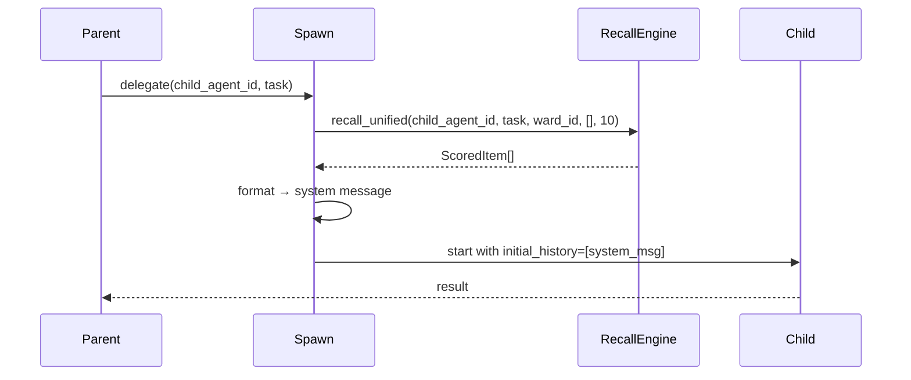

`top_k = 10`.

### 12.5 Loop 4 — Mid-session refresh

A middleware hook that fires every `every_n_turns` (default 5) during long-running sessions:

- Builds a query from the recent assistant + user messages
- Calls recall_unified with novelty filter (`min_novelty_score = 0.3`)
- If novel results found, injects as a system message

This is the "the conversation drifted into a new topic" loop — recall fires again to surface freshly-relevant facts.

### 12.6 Loop 5 — Post-session distillation

See [§13](#13-distillation-pipeline-post-session). Runs at session completion. Writes to facts, entities, relationships, episodes.

### 12.7 Loop 6 — Sleep-time pipeline

See [§10](#10-layer-7--reflective-synthesis-sleep-time-pipeline).

### 12.8 Integration contracts

Each loop has a stable surface:

| Loop | Surface |
|--|--|
| 1 | `before_first_message(session_id) → history_prefix: ChatMessage[]` |
| 2 | `before_intent_analysis(user_msg) → memory_context: string` |
| 3 | `before_subagent_spawn(child_id, task, ward) → initial_history: ChatMessage[]` |
| 4 | `mid_session_tick(session_id, turn_count) → optional<ChatMessage>` |
| 5 | `after_session_complete(session_id, agent_id) → ()` (async writes) |
| 6 | `sleep_tick() → CycleStats` |

Implementations can substitute any of these for testing (e.g. fixture recall) without changing the agent loop.

---

## 13. Distillation Pipeline (Post-Session)

### 13.1 Purpose

Convert raw session transcripts into structured knowledge. The agent's full message history is rich but unindexed; distillation produces the atomic facts, entities, relationships, and episodic summary that recall will draw from.

### 13.2 Inputs

- Full message history of the session (user + assistant + tool messages)
- Session metadata (ward, agent, outcome, duration, token cost)
- Existing facts (for dedup awareness)

### 13.3 Outputs

| Table | What's written |
|--|--|
| `memory_facts` | New atomic facts (LLM-extracted, verified, deduped) |
| `kg_entities` | New entities (normalised, alias-resolved) |
| `kg_relationships` | New edges (deduped via unique constraint) |
| `kg_episodes` | One row summarising the session (outcome, strategy, learnings) |
| `procedures` | (Optional) If the user explicitly says "remember how to do this" |
| `distillation_runs` | Audit: success/fail status, counts, duration |

### 13.4 Pipeline

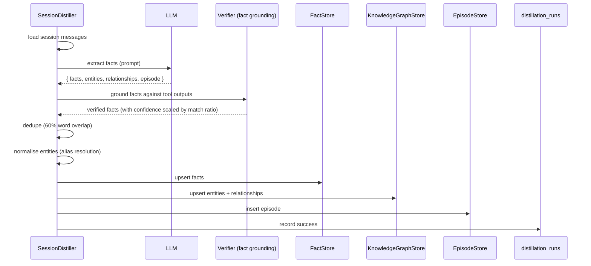

### 13.5 Fact verification

Each distilled fact is checked against the session's tool outputs. Words from the fact that appear in any tool output count as "grounded." Confidence is scaled:

```
confidence_final = confidence_llm × match_ratio
```

This prevents hallucinated "facts" with no evidence from polluting memory.

### 13.6 Fact dedup

Two passes:

1. **Key-based** — `(agent_id, scope, ward_id, key)` unique constraint upserts duplicates.
2. **Word-overlap** — for facts with different keys but similar content (60%+ word overlap), the older fact's `mention_count` is bumped and the new one is dropped.

### 13.7 Entity normalisation

Entities are normalised to a canonical surface form:

- Filenames: basename matching (`/a/b/c.py` → `c.py`)
- Identifiers: lowercased, whitespace-collapsed
- Aliases tracked in `kg_aliases` (e.g. "OpenAI GPT-4o" and "gpt-4o" point to the same entity)

The `normalized_hash` column provides O(1) dedup lookup.

### 13.8 Relationship dedup

`UNIQUE(source_entity_id, target_entity_id, relationship_type)` constraint. Re-asserting bumps `mention_count`.

### 13.9 Episode extraction

One row per session, summarising:

- `task_summary` — what was attempted
- `outcome` — `success` / `partial` / `failure`
- `strategy_used` — short description of the approach taken
- `key_learnings` — bullet-list of takeaways
- `token_cost` — for accounting and predictive boost

### 13.10 Failure handling

Distillation is **non-blocking**: errors are logged to `distillation_runs` (status: `failed` + error message) but never crash the session loop. A retroactive backfill command can re-run distillation on failed or pre-pipeline sessions.

### 13.11 Why it matters

Without distillation, the session transcript is dead weight — it can be reread but not searched. Distillation makes every session contribute to long-term memory.

### 13.12 Where it matters

- Fires once per session at completion.
- Output feeds all of Layers 1, 2, and (via episodes) the predictive boost on Loop 5.
- Failure flagged in `distillation_runs` (queryable health table).

---

## 14. Confidence & Decay

### 14.1 Confidence model

Every aging row carries `confidence ∈ [0.0, 1.0]`:

- New facts: default `0.8`
- Distillation-verified facts: scaled by grounding match ratio
- LLM-synthesised (beliefs, schemas, strategies): from LLM response, default 0.7 minimum
- Pinned: `1.0` (user-marked, never decays)

### 14.2 Decay formula

```
new_confidence = old_confidence × (1 / (1 + age_days / half_life_days))
```

Where `age_days = days_since_last_accessed_at`.

### 14.3 Per-type half-lives

| Type | Half-life (days) |
|--|--|
| KG entities | 90 (configurable) |
| KG relationships | 90 (configurable) |
| Memory facts: corrections | 90 |
| Memory facts: strategies | 60 |
| Memory facts: patterns | 45 |
| Memory facts: domain | 30 |
| Memory facts: instructions | 120 |
| Memory facts: user | 180 |

### 14.4 Skip conditions

- `last_accessed_at < skip_recent_hours` (default 24): row was recently used, skip decay
- `pinned = 1`: never decay
- `category IN ('skill', 'agent')`: indexer-managed, skip decay

### 14.5 Archive on floor breach

When confidence drops below `min_confidence` (default 0.01):

- Row is **copied** to the type's archive table (`memory_facts_archive`, `kg_entities_archive` if implemented)
- Row is **deleted** from the live table
- Audit entry written to `kg_compactions` with `operation = 'prune'`

Archives are excluded from recall but available for historical queries.

### 14.6 Contradiction propagation (cross-layer)

When a fact's confidence drops below `fact_confidence_drop_threshold` (default 0.3) **due to a contradiction** (not normal age):

- All beliefs that include the fact in `source_fact_ids` are marked `stale = 1`
- Affected KG relationships are decayed extra
- Next sleep cycle's belief synthesiser picks up stale beliefs and re-synthesises

This is the cross-layer health link: drops in Layer 1 ripple into Layers 2 and 5.

### 14.7 Recall implications

The priority engine reads `confidence` directly:

```
score_with_confidence = base_score × confidence × ...
```

So decay naturally lowers recall priority without any extra logic.

### 14.8 Bulk decay job

A periodic (sleep-time) batch job decays all aging rows in a single SQL UPDATE for efficiency:

```sql
-- Conceptual; specifics depend on engine
UPDATE memory_facts
SET confidence = confidence * (1.0 / (1.0 + (julianday('now') - julianday(updated_at)) / 90.0))
WHERE pinned = 0
  AND last_accessed_at IS NULL OR julianday('now') - julianday(last_accessed_at) > 1.0
  AND category NOT IN ('skill', 'agent');
```

Generic equivalent: one bulk UPDATE per type, executed during sleep-time cycle. Avoids row-by-row decay overhead.

---

## 15. Configuration

### 15.1 `recall_config.json`

Loaded from `{vault}/config/recall_config.json`. Deep-merged with compiled defaults: missing file → defaults; partial file → merged (user values win per key); corrupted file → defaults with warning.

```json
{
  "categoryWeights": {
    "schema": 1.6,
    "belief": 1.5,
    "correction": 1.5,
    "strategy": 1.4,
    "user": 1.3,
    "instruction": 1.2,
    "domain": 1.0,
    "pattern": 0.9,
    "ward": 0.8,
    "skill": 0.7,
    "agent": 0.7
  },
  "wardAffinityBoost": 1.3,
  "maxRecallTokens": 3000,
  "vectorWeight": 0.7,
  "bm25Weight": 0.3,
  "maxFacts": 10,
  "maxEpisodes": 3,
  "highConfidenceThreshold": 0.9,
  "contradictionPenalty": 0.7,
  "minScore": 0.3,
  "midSessionRecall": {
    "enabled": true,
    "everyNTurns": 5,
    "minNoveltyScore": 0.3
  },
  "graphTraversal": {
    "enabled": true,
    "maxHops": 2,
    "hopDecay": 0.6,
    "maxGraphFacts": 5,
    "minKgConfidence": 0.1
  },
  "temporalDecay": {
    "enabled": true,
    "halfLifeDays": {
      "correction": 90.0,
      "strategy": 60.0,
      "domain": 30.0,
      "user": 180.0,
      "pattern": 45.0,
      "instruction": 120.0
    },
    "pruneThreshold": 0.05,
    "pruneAfterDays": 30
  },
  "predictiveRecall": {
    "enabled": true,
    "minSimilarSuccesses": 2,
    "predictiveBoost": 1.3,
    "maxEpisodesToCheck": 5
  },
  "sessionOffload": {
    "enabled": true,
    "offloadAfterDays": 7,
    "keepSessionMetadata": true,
    "archivePath": "data/archive"
  },
  "kgDecay": {
    "enabled": true,
    "entityHalfLifeDays": 90.0,
    "relationshipHalfLifeDays": 90.0,
    "minConfidence": 0.01,
    "skipRecentHours": 24
  }
}
```

(Note: `vectorWeight` and `bm25Weight` are retained for forward-compat but RRF is the active retrieval algorithm; weighted fusion is a fallback if RRF is disabled.)

### 15.2 `MemorySettings` (high-level toggles)

```typescript
interface MemorySettings {
  hierarchy: {
    enabled: boolean;                  // default false
    cluster_target_size: number;       // default 20
    max_layers: number;                // default 4
    inter_cluster_relation_threshold: number;  // default 3
    llm_budget_per_cycle: number;      // default 50
  };
  beliefs: {
    enabled: boolean;                  // default false
    synthesizer_version: number;       // bumped on prompt changes
    contradiction_budget_per_cycle: number;    // default 20
  };
  sleep_time: {
    interval_seconds: number;          // default 3600
    enabled: boolean;                  // default true
  };
  decay: KgDecayConfig;
}
```

### 15.3 `HierarchyConfig` (cluster builder tuning)

| Setting | Default | Meaning |
|--|--|--|
| `cluster_target_size` | 20 | Aim for clusters of this size |
| `max_layers` | 4 | Cap on layering depth |
| `sparsity_epsilon` | small | Stop layering when too many singletons |
| `inter_cluster_relation_threshold` | 3 | Min co-mentions before aggregate edge |
| `llm_budget_per_cycle` | 50 | Cap LLM calls per cycle |
| `seed` | constant | Deterministic clustering |

### 15.4 Per-task LLM routing for memory work

Layer 7 (and embedding generation, multimodal analysis, etc.) can each route to a distinct provider/model independently of the orchestrator:

| Task tag | What it controls |
|--|--|
| `sleep_time` | All sleep-time pipeline LLM calls (synth, beliefs, abstraction, conflict, verifier, pattern extraction, handoff) |
| `distillation` | Post-session distillation extractor |
| `intent_analysis` | Per-prompt routing classifier |
| `curator` | Ward consolidation cycles |
| `multimodal` | Vision analysis |

3-tier resolution: per-task override → orchestrator → provider default.

Implementation contract:

```typescript
interface MemoryLlmFactory {
  build_client(config: LlmClientConfig): Promise<LlmClient>;
}

interface LlmClientConfig {
  temperature: number;
  max_tokens: number;
  task?: string;        // 'sleep_time' | 'distillation' | etc.
}
```

The factory reads execution settings at call-time, picks the right slot per tag, and constructs an LLM client. Untagged calls fall through to orchestrator settings.

---

## 16. Framework-Agnostic Interfaces

The complete set of contracts a reimplementation must satisfy. All shown in pseudo-TypeScript for portability; the reference Rust implementation lives at the paths cited in §1.1.

### 16.1 `MemoryFactStore`

```typescript
interface MemoryFactStore {
  save_fact(
    agent_id: string,
    category: string,
    key: string,
    content: string,
    confidence: number,
    session_id?: string,
    valid_from?: DateTime,
  ): Promise<MemoryFact>;

  recall_facts(
    agent_id: string,
    query: string,
    limit: number,
  ): Promise<MemoryFact[]>;

  recall_facts_prioritized(
    agent_id: string,
    query: string,
    limit: number,
    as_of?: DateTime,                  // point-in-time recall
  ): Promise<MemoryFact[]>;

  search_memory_facts_hybrid(
    agent_id: string | null,
    query: string,
    mode: 'fts' | 'semantic' | 'hybrid',
    limit: number,
    ward_id?: string,
    query_embedding?: number[],
    as_of?: DateTime,
  ): Promise<ScoredFact[]>;

  get_facts_by_category(
    agent_id: string,
    category: string,
    limit: number,
  ): Promise<MemoryFact[]>;

  get_high_confidence_facts(
    agent_id: string | null,
    threshold: number,
    limit: number,
  ): Promise<MemoryFact[]>;

  supersede_fact(
    old_id: string,
    new_id: string,
    transition_time: DateTime,         // when the old fact stopped being true
  ): Promise<void>;

  bump_mention_count(fact_id: string): Promise<void>;
  pin_fact(fact_id: string): Promise<void>;
  archive_fact(fact_id: string): Promise<void>;
}
```

### 16.2 `KnowledgeGraphStore`

```typescript
interface KnowledgeGraphStore {
  upsert_entity(input: EntityInput): Promise<Entity>;
  upsert_relationship(input: RelationshipInput): Promise<Relationship>;
  upsert_alias(entity_id: string, surface_form: string, source: string): Promise<void>;

  get_entity(id: string): Promise<Entity | null>;
  find_entity_by_normalized(
    agent_id: string,
    entity_type: string,
    normalized_hash: string,
  ): Promise<Entity | null>;

  list_entities_with_embeddings_at_layer(
    agent_id: string,
    layer: number,
  ): Promise<Array<{ entity: Entity, embedding: number[] }>>;

  expand_from_entities(
    seed_ids: string[],
    max_hops: number,
    hop_decay: number,
    min_confidence: number,
  ): Promise<Array<{ entity_id: string, score: number }>>;

  list_strategy_candidates(
    min_sessions: number,
    lookback_days: number,
    limit: number,
  ): Promise<Entity[]>;

  promote_cluster_to_aggregate(
    members: string[],
    aggregate_name: string,
    aggregate_description: string,
    layer: number,
  ): Promise<Entity>;

  insert_inter_cluster_relation(
    source_aggregate_id: string,
    target_aggregate_id: string,
    relationship_type: string,
    lambda: number,
    layer: number,
  ): Promise<Relationship>;

  decay_confidence(
    half_life_days: number,
    skip_recent_hours: number,
  ): Promise<{ entities_decayed: number, relationships_decayed: number }>;
}
```

### 16.3 `BeliefStore`

```typescript
interface BeliefStore {
  upsert_belief(belief: BeliefInput): Promise<Belief>;
  list_beliefs(partition_id: string, limit: number): Promise<Belief[]>;
  list_stale(partition_id: string, limit: number): Promise<Belief[]>;
  clear_stale(belief_id: string): Promise<void>;
  supersede_belief(old_id: string, new_id: string, transition_time: DateTime): Promise<void>;
}

interface BeliefContradictionStore {
  insert_contradiction(c: BeliefContradiction): Promise<void>;
  pair_exists(a_id: string, b_id: string): Promise<boolean>;
  list_unresolved(limit: number): Promise<BeliefContradiction[]>;
  resolve(id: string, resolution: string): Promise<void>;
}
```

### 16.4 `ProcedureStore`

```typescript
interface ProcedureStore {
  insert_pattern_procedure(input: PatternProcedureInsert): Promise<Procedure>;
  get_procedure_by_name(agent_id: string, name: string): Promise<Procedure | null>;
  get_procedure_summary_by_name(agent_id: string, name: string): Promise<ProcedureSummary | null>;
  list_procedures(agent_id: string, ward_id?: string): Promise<Procedure[]>;
  semantic_search(
    agent_id: string,
    query_embedding: number[],
    limit: number,
  ): Promise<Procedure[]>;
  record_success(id: string, duration_ms: number, token_cost: number): Promise<void>;
  record_failure(id: string, error: string): Promise<void>;
}
```

### 16.5 `EpisodeStore`

```typescript
interface EpisodeStore {
  insert_episode(input: EpisodeInput): Promise<Episode>;
  list_successful_episodes_with_embedding(
    lookback_days: number,
    limit: number,
  ): Promise<Array<{ episode: Episode, embedding: number[] }>>;
  task_summaries_for_sessions(session_ids: string[]): Promise<Record<string, string>>;
  episode_ids_for_entity(entity_id: string, lookback_days: number): Promise<string[]>;
}
```

### 16.6 `EmbeddingClient`

```typescript
interface EmbeddingClient {
  embed(texts: string[]): Promise<number[][]>;       // one vector per text
  dimensions(): number;
  model_name(): string;
}

interface EmbeddingConfig {
  provider: 'local' | { provider_id: string };
  model: string;
  dimensions: number;
  batch_size: number;
  cache_enabled: boolean;
  idle_timeout_secs: number;
}
```

### 16.7 `MemoryLlmFactory`

```typescript
interface MemoryLlmFactory {
  build_client(config: LlmClientConfig): Promise<LlmClient>;
}

interface LlmClientConfig {
  temperature: number;
  max_tokens: number;
  task?: string;                       // routing tag, e.g. 'sleep_time'
}
```

### 16.8 `PairwiseVerifier`

```typescript
interface PairwiseVerifier {
  should_merge(a: Entity, b: Entity): Promise<boolean>;
}
```

**Contract:** must default to `false` on any LLM failure.

### 16.9 `GraphTraversal`

```typescript
interface GraphTraversal {
  expand_from_entity(
    entity_id: string,
    max_hops: number,
    hop_decay: number,
  ): Promise<TraversalResult[]>;

  find_related(
    entity_ids: string[],
    relationship_types?: string[],
  ): Promise<TraversalResult[]>;
}
```

**Contract:** must be swappable. Reference implementation uses SQL recursive CTE; alternative implementations can use Neo4j, Memgraph, or any property-graph engine.

### 16.10 `RecallEngine` (the top-level surface)

```typescript
interface RecallEngine {
  recall_unified(
    agent_id: string,
    query: string,
    ward_id: string | null,
    active_goals: GoalLite[],
    budget: number,
    as_of?: DateTime,
  ): Promise<ScoredItem[]>;
}
```

This is the single entry point all six memory loops call. Implementations compose `MemoryFactStore`, `KnowledgeGraphStore`, `BeliefStore`, `ProcedureStore`, plus an `EmbeddingClient`, to produce the unified ranked result.

### 16.11 `SessionDistiller`

```typescript
interface SessionDistiller {
  distill(session_id: string, agent_id: string): Promise<DistillationRun>;
}
```

Called once per completed session. Reads transcript, writes to all Layer 1 and Layer 2 stores, records to `distillation_runs`.

### 16.12 `SleepTimeWorker`

```typescript
interface SleepTimeWorker {
  start(interval: Duration, agent_id: string): void;
  trigger(): void;                     // non-blocking on-demand fire
  stop(): Promise<void>;
}
```

Spawns a background worker that fires `run_cycle` on either interval ticks or `trigger()` calls.

---

## 17. Implementation Sequencing

A reimplementation should be built bottom-up. Each milestone is independently shippable.

### 17.1 MVP — Layer 1 only

**Build:**

- `memory_facts` table with bi-temporal columns
- Lexical index (FTS5 or equivalent) with sync triggers
- `MemoryFactStore` with `save_fact`, `recall_facts`, `get_facts_by_category`
- Loop 1 (system recall) — simplest possible: keyword-only recall, no scoring
- Loop 5 (distillation) — LLM extraction, no verification yet

**Outcome:** Agent remembers facts across sessions. Already meaningfully better than stateless.

### 17.2 Milestone 2 — Add scoring + vector

**Build:**

- Vector ANN index
- Embedding client + cache
- RRF fusion in recall
- Category weights, temporal decay, mention boost in scoring
- `recall_log` for audit
- Loop 3 (subagent priming)

**Outcome:** Recall is now relevance-ranked. Subagents inherit relevant context.

### 17.3 Milestone 3 — Knowledge graph (Layer 2)

**Build:**

- `kg_entities`, `kg_relationships`, `kg_aliases`
- Entity normalisation + alias resolution in distillation
- 2-hop graph expansion in recall
- `GraphTraversal` trait
- `KnowledgeGraphStore`

**Outcome:** Recall finds connected context, not just keyword matches. Agent understands relationships.

### 17.4 Milestone 4 — Bi-temporal (Layer 3)

**Build:**

- `valid_from` / `valid_until` columns populated on write
- Point-in-time recall API (`as_of`)
- `supersede_fact` writer
- `epistemic_class` column

**Outcome:** Stale facts don't pollute current recall. Audits become possible.

### 17.5 Milestone 5 — Procedures (Layer 6)

**Build:**

- `procedures` table + step interpolation
- `run_procedure` tool
- Optional: pattern miner (sleep-time stage)

**Outcome:** Agent replays known-good sequences instead of re-planning.

### 17.6 Milestone 6 — Minimal sleep-time pipeline (Layer 7)

**Build:**

- `SleepTimeWorker` (interval + trigger)
- Compactor (entity dedup with pairwise verifier)
- Decay engine + bulk decay job
- Pruner + archive

**Outcome:** Memory stays clean over weeks/months instead of accumulating noise.

### 17.7 Milestone 7 — Reflective abstractions

**Build:**

- Corrections Abstractor (corrections → schemas)
- Conflict Resolver (with supersession + propagation)
- Pattern Extractor (procedure mining)
- Synthesiser (cross-session strategies)

**Outcome:** Memory self-improves. Corrections sharpen into principles. Strategies emerge.

### 17.8 Milestone 8 — Hierarchical memory (Layer 4)

**Build:**

- `layer` + `parent_cluster_id` columns
- K-means clustering module
- Hierarchy Builder sleep-time stage
- LCA-bounded recall

**Outcome:** Recall scales to 10k+ entities without noise.

### 17.9 Milestone 9 — Belief network (Layer 5)

**Build:**

- `kg_beliefs` + `kg_belief_contradictions` tables
- Belief Synthesiser sleep-time stage
- Belief Contradiction Detector sleep-time stage
- Belief propagation (stale flag, re-synthesis)
- Recall integration (beliefs as ScoredItem kind)

**Outcome:** System has a coherent "current best understanding" instead of noisy fact lists.

### 17.10 Milestone 10 — Production polish

**Build:**

- Handoff Writer (per-session summary)
- Mid-session recall (Loop 4)
- Predictive boost (Loop 5 → Loop 1 feedback)
- Per-task LLM routing
- Observability dashboards

**Outcome:** Memory is a polished, observable, multi-tenant system.

---

## 18. Verification & Test Strategy

### 18.1 Layer-by-layer test plan

| Layer | Critical tests |
|--|--|
| 1 | Upsert idempotency, scope isolation, FTS sync triggers fire on insert/update/delete, ward filter |
| 2 | Entity dedup via `normalized_hash`, relationship uniqueness, alias resolution, 2-hop traversal returns expected nodes |
| 3 | `valid_until` set on supersession, point-in-time recall excludes future-valid facts, contradiction penalty applied |
| 4 | Cluster builder converges, LCA computation correct, inter-cluster relations surface separately |
| 5 | Single-fact short-circuit, multi-fact LLM synthesis, recency-weighted confidence, stale propagation clears after re-synth, contradiction pair uniqueness |
| 6 | Step interpolation works for `{{parameter}}` and `{{step_N.field}}`, `success_count` increments, failure increments `failure_count` |
| 7 | Pipeline runs end-to-end without crashing on per-stage errors, stats roll up correctly, idempotent re-run produces same output |

### 18.2 Critical invariants to assert

1. **Recall always returns within budget** — no result list exceeds requested limit
2. **No row deleted that's in a foreign-key relationship** — cascading deletes work
3. **Vector index stays in sync** — deleting a fact removes its embedding (trigger or app cascade)
4. **Decay is bounded** — confidence never goes below `min_confidence` (1e-6) before archive
5. **Supersession is atomic** — `valid_until` and `superseded_by` set in same transaction
6. **Sleep-time cycle never throws** — every stage's errors are caught and logged

### 18.3 Smoke test (end-to-end)

```
1. Save 5 facts across categories (correction, strategy, user, domain, pattern)
2. Run recall with a query that matches keywords in 3 of them
3. Verify ordering: correction first (weight 1.5×), strategy second (1.4×), domain last (1.0×)
4. Supersede one fact; verify it disappears from recall
5. Run sleep-time cycle; verify cycle stats are non-zero
6. Verify recall_log entries were written for the 3 recalled facts
```

### 18.4 Failure injection

Test the "conservative" guarantees by injecting:

- LLM timeouts on the verifier → entity should NOT merge
- LLM errors on belief synthesis → fall back to most-recent fact verbatim
- Embedding failure → procedure inserts with `embedding = NULL`
- One stage panics → subsequent stages still run

---

## 19. Glossary

| Term | Meaning |
|--|--|
| **Agent** | An LLM-backed worker with its own identity and (optionally) ward |
| **Alias** | A surface-form variant pointing to a canonical entity |
| **ANN** | Approximate Nearest Neighbour — a vector index that returns similar vectors quickly |
| **BM25** | A classic lexical relevance ranking function (Best Matching 25) |
| **Belief** | A multi-fact synthesised current position on a subject |
| **Bi-temporal** | Carrying two timelines: when learned (transaction) and when true (valid) |
| **Compaction** | Merging near-duplicate entities; pruning low-confidence rows |
| **Cluster (in hierarchy)** | A group of layer-N entities aggregated into a single layer-N+1 entity |
| **Confidence** | A `[0.0, 1.0]` scalar reflecting how trustworthy a fact/entity/belief is |
| **Contradiction** | A conflict between two beliefs or facts (logical or tension) |
| **Decay** | Reducing confidence over time based on age + non-access |
| **Distillation** | Post-session extraction of structured knowledge from session transcripts |
| **Episode** | A summary row capturing what happened in one session |
| **Epistemic class** | `current` / `historical` / `hypothetical` truth status tag |
| **FTS5** | SQLite's full-text-search engine (one possible BM25 implementation) |
| **Ground** | Verify a distilled fact against actual tool outputs |
| **Handoff** | A session-end summary written for the next session's boot |
| **Hierarchy** | The layered cluster tree built over the knowledge graph (HiRAG / LeanRAG) |
| **HiRAG** | Hierarchical RAG — cluster-based retrieval over a layered graph |
| **LCA** | Lowest Common Ancestor — used to constrain hierarchical recall |
| **LeanRAG** | An LCA-bounded variant of HiRAG |
| **Memory loop** | One of six recurring memory invocations during the agent lifecycle |
| **Normalized hash** | Hash of the normalised entity name, used for O(1) dedup lookup |
| **Pair verifier** | LLM adjudicator that decides whether two entities should merge |
| **Pinned** | Marked as never-decay (user explicit) |
| **Predictive boost** | Score multiplier for facts that helped in past successful sessions |
| **Procedure** | A replayable, parameterised sequence of tool calls (runbook) |
| **Provenance** | The source layer + ID for each ranked recall item |
| **Recall** | The act of fetching relevant memory given a query |
| **RRF** | Reciprocal Rank Fusion — rank-based combination of multiple search arms |
| **Schema (category)** | A general principle abstracted from many corrections |
| **Scope** | `agent` / `global` / `ward` — controls who sees a fact |
| **Sleep-time** | Background reflection pipeline (Layer 7) |
| **Stale (belief flag)** | Marker that a belief's underlying facts changed and it needs re-synthesis |
| **Supersession** | Marking an old row as replaced by a new one (with truth-interval closure) |
| **Tension (contradiction type)** | Different facets of the same subject that could both be true with context |
| **Vec0** | SQLite's vector-search virtual table (one possible ANN implementation) |
| **Ward** | A domain-scoped working directory and agent — facts can be ward-scoped |

---

## Appendix A — Schema Cheat Sheet (knowledge.db)

Quick reference table — all canonical memory tables:

| Table | Layer | Purpose |
|--|--|--|
| `memory_facts` | 1 | Atomic facts (corrections, strategies, etc.) |
| `memory_facts_fts` | 1 | Lexical (BM25) index over facts |
| `memory_facts_index` | 1 | Vector ANN index over facts |
| `memory_facts_archive` | 1 | Decay output |
| `session_episodes` | 1 | Per-session summary |
| `session_episodes_index` | 1 | Vector ANN over episode summaries |
| `recall_log` | 1 | Audit of which facts were recalled when |
| `distillation_runs` | 1 | Health tracking for distillation |
| `kg_entities` | 2 | Knowledge-graph nodes (incl. hierarchy `layer`) |
| `kg_relationships` | 2 | KG edges (incl. `is_inter_cluster`) |
| `kg_aliases` | 2 | Surface-form variants |
| `kg_causal_edges` | 2 | Cause→effect observations |
| `kg_episodes` | 2 | Ingest queue for KG distillation |
| `kg_episode_payloads` | 2 | Raw text for episodes |
| `kg_goals` | 2 | Active/completed goals (optional) |
| `kg_compactions` | 2/7 | Audit trail for merges/supersessions |
| `kg_name_index` | 2 | Vector ANN over entity names |
| `kg_beliefs` | 5 | Synthesised beliefs |
| `kg_belief_contradictions` | 5 | Belief conflict graph |
| `procedures` | 6 | Replayable runbooks |
| `procedures_index` | 6 | Vector ANN over procedure descriptions |
| `ward_wiki_articles` | (companion) | Long-form ward knowledge |
| `ward_wiki_articles_fts` | (companion) | BM25 over wiki |
| `wiki_articles_index` | (companion) | Vector ANN over wiki |
| `embedding_cache` | (infra) | Content-hash → embedding cache |
| `skill_index_state` | (infra) | Indexer state for skills/agents/wards |
| `schema_version` | (infra) | Migration version |

---

## Appendix B — Default Constants Quick Reference

| Constant | Default | Where |
|--|--|--|
| RRF_K | 60 | Recall fusion |
| K_retrieval | 3 × budget | Recall fusion |
| min_score | 0.3 | Recall priority engine |
| ward_affinity_boost | 1.3 | Recall priority engine |
| contradiction_penalty | 0.7 | Recall priority engine |
| max_recall_tokens | 3000 | Recall budget |
| max_facts | 10 | Recall budget |
| max_episodes | 3 | Recall budget |
| graph_max_hops | 2 | Graph expansion |
| graph_hop_decay | 0.6 | Graph expansion |
| min_kg_confidence | 0.1 | Graph expansion filter |
| MIN_CORRECTIONS_TO_ABSTRACT | 3 | Corrections Abstractor |
| Synthesiser similarity dedup | 0.88 cosine | Synthesiser |
| Conflict Resolver similarity | 0.85 cosine | Conflict Resolver |
| Pattern Extractor similarity | 0.82 cosine | Pattern Extractor |
| Pattern Extractor min prefix | 3 | Pattern Extractor |
| MAX_LLM_CALLS_PER_CYCLE (synth) | 10 | Synthesiser |
| MAX_LLM_CALLS_PER_CYCLE (pattern) | 5 | Pattern Extractor |
| MAX_LLM_CALLS_PER_CYCLE (conflict) | 10 | Conflict Resolver |
| Belief contradiction budget | 20 | Belief Contradiction Detector |
| Belief synth confidence weight | 1/(1 + age_days/90) | Belief Synthesiser |
| sleep_time interval | 3600 sec | Sleep Worker |
| handoff stale guard | 7 days | Handoff Writer |
| handoff temperature | 0.2 | Handoff Writer (only non-zero) |
| All other reflection temperatures | 0.0 | Layer 7 |
| KG entity half-life | 90 days | Decay |
| KG relationship half-life | 90 days | Decay |
| fact_confidence_drop_threshold | 0.3 | Contradiction Propagation |
| min_confidence (archive floor) | 0.01 | Decay |
| skip_recent_hours | 24 | Decay |
| every_n_turns (mid-session) | 5 | Loop 4 |
| min_novelty_score | 0.3 | Loop 4 |
| predictive_boost | 1.3 | Loop 5 feedback |
| min_similar_successes | 2 | Predictive boost |

---

**End of specification.**
