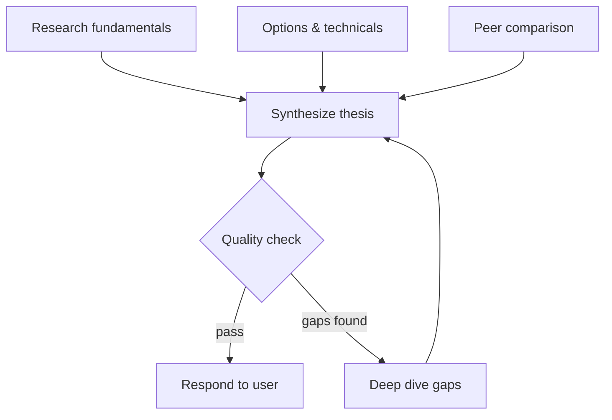

# Intent Analysis Enrichment Design

## Problem Statement

The current `analyze_intent` system has three problems:

1. **Messy code**: `intent.rs` is 2,070 lines mixing resource discovery, a 517-line LLM prompt, heuristic scoring with hand-tuned domain boosters, ward recommendations, and execution planning
2. **Skills load immediately**: Identified skills are loaded eagerly instead of on-demand, polluting the agent's context
3. **Not actually wired up**: `AnalyzeIntentTool` exists but is not registered in the tool registry, while the system prompt tells agents to call it

Meanwhile, the `pivot` branch has valuable planning autonomy work (plan-as-contract execution, delegation concurrency, message integrity) that needs to be merged.

## Design

### Core Concept

Replace the 2,070-line `AnalyzeIntentTool` with a ~250-line **pre-execution enrichment step** that runs transparently before the root agent's first LLM call. It makes one LLM call to analyze intent, then injects a dynamic `## Intent Analysis` section into the system prompt. The agent never knows the analysis happened -- it just starts with better context.

**Architectural note**: This is NOT a `PreProcessMiddleware` (which operates on `Vec<ChatMessage>` before each LLM turn). It is a one-shot enrichment function called from the runner layer (`ExecutionRunner`) before the executor is constructed. It mutates the system prompt, which is then passed into `ExecutorBuilder::build()`. The file lives at `gateway/gateway-execution/src/middleware/intent_analysis.rs` for organizational clarity, but it is invoked from the runner, not from the middleware pipeline.

### Principles

- **No conditional logic in code** -- the LLM decides everything (no domain boosters, no keyword matching, no scoring weights)
- **Root agent only** -- subagents and continuation turns skip enrichment (see Root-Only Gate)
- **Recommend, don't inject** -- skills are recommended in the system prompt, not pre-loaded. The agent calls `load_skill`/`unload_skill` on demand
- **Same model as agent** -- no separate model configuration for analysis
- **Use existing service data** -- skills/agents summaries already collected by the executor builder, no separate indexing step

### Pipeline Position

The enrichment is called from the runner layer (not inside `build()`), because the runner has access to the user message while `build()` does not. The enriched system prompt is then passed into the builder:

```
ExecutionRunner::invoke() / create_executor()
  |-- collect_agents_summary()                 <-- existing, returns Vec<Value>
  |-- collect_skills_summary()                 <-- existing, returns Vec<Value>
  |-- create LlmClient                        <-- existing
  |-- IF is_root AND NOT continuation:
  |     analyze_intent(&llm_client, &user_message, &skills, &agents)  <-- NEW
  |     inject_intent_context(&mut system_prompt, &analysis)          <-- NEW
  |-- ExecutorBuilder::build(system_prompt, ...)  <-- existing, now with enriched prompt
```

**Key dependency**: `analyze_intent` reuses the same `LlmClient` instance created for the executor. The user message is available at the runner level via `ExecutionConfig`. Its signature:

```rust
pub async fn analyze_intent(
    llm_client: &dyn LlmClient,
    user_message: &str,
    available_skills: &[Value],
    available_agents: &[Value],
) -> Result<IntentAnalysis>
```

**Internal call pattern**:

```rust
// Inside analyze_intent:
let messages = vec![
    ChatMessage::system(INTENT_ANALYSIS_PROMPT),
    ChatMessage::user(format_user_template(user_message, skills, agents)),
];
let response = llm_client.chat(messages, None).await?;
let analysis: IntentAnalysis = serde_json::from_str(&response.content)?;
Ok(analysis)
```

### Root-Only Gate

`ExecutorBuilder::build()` currently has no knowledge of whether it is building a root or delegated executor. To support the gate:

**API change**: Add `is_root: bool` to `ExecutorBuilder`:

```rust
impl ExecutorBuilder {
    pub fn with_root(mut self, is_root: bool) -> Self {
        self.is_root = is_root;
        self
    }
}
```

- Root invocations (`ExecutionRunner::invoke()`) call `.with_root(true)`
- Delegated spawns (`spawn_delegated_agent()`) call `.with_root(false)`
- Continuation turns (`invoke_continuation()`) call `.with_root(false)` -- the root agent already has intent context from the original turn; re-analyzing would waste an LLM call and could produce conflicting analysis

The enrichment step only runs when `self.is_root == true`.

### Resource Data

The enrichment does NOT re-scan the filesystem. `ExecutorBuilder::build()` already receives `available_skills` and `available_agents` as `Vec<serde_json::Value>` via `collect_skills_summary()` and `collect_agents_summary()` which query the service layer. The enrichment formats these into the LLM prompt directly.

**Implementation note**: The current `build()` moves `available_skills` and `available_agents` into `executor_config.with_initial_state()` early. The enrichment call must happen before this move, or the values must be cloned/borrowed first. The recommended pattern is to clone the skill/agent summaries before they are moved into state, passing the clones to `analyze_intent`.

This avoids duplicating the indexer's work and respects the service layer boundary.

### LLM Prompt

A focused ~60-80 line system prompt. Draft:

```
You are an intent analyzer for an AI agent platform.

Given a user request and the platform's available resources, your job is to:
1. Identify the primary intent behind the request
2. Discover hidden/implicit intents the user hasn't stated but would expect
3. Recommend which skills and agents would help
4. Design an execution graph showing how to orchestrate the work

## Rules
- Hidden intents must be actionable instructions, not labels
- Every non-trivial execution must end with a quality verification node
- Use conditional edges when outcomes determine next steps
- Recommend only skills and agents from the provided lists
- If the request is simple (greeting, quick question), use approach "simple" with no graph

## Output Format
Respond with a single JSON object matching this schema:
{
  "primary_intent": "string -- the core intent category",
  "hidden_intents": ["string -- actionable instruction for each hidden intent"],
  "recommended_skills": ["skill-name"],
  "recommended_agents": ["agent-name"],
  "execution_strategy": {
    "approach": "simple | tracked | graph",
    "graph": {
      "nodes": [{"id": "A", "task": "description", "agent": "agent-name", "skills": ["skill"]}],
      "edges": [
        {"from": "A", "to": "B"},
        {"from": "B", "conditions": [{"when": "condition text", "to": "C"}, {"when": "other", "to": "END"}]}
      ],
      "mermaid": "graph TD string for visualization",
      "max_cycles": 2
    },
    "explanation": "string -- why this orchestration shape"
  },
  "rewritten_prompt": "string -- the user's message with implicit intent made explicit"
}

Only include the "graph" field when approach is "graph".
```

The user message template:

```
### User Request
{message}

### Available Skills
{formatted list of skill name: description}

### Available Agents
{formatted list of agent name: description}
```

### Output Schema

```json
{
  "primary_intent": "financial_analysis",
  "hidden_intents": [
    "Research LMND fundamentals -- revenue, earnings, growth metrics via web search",
    "Pull options chain data to assess market sentiment and implied volatility",
    "Analyze technical indicators -- moving averages, RSI, support/resistance levels",
    "Compare against insurance industry peers for relative valuation",
    "Assess recent news and catalyst events that could impact price action"
  ],
  "recommended_skills": ["stock-analysis", "web-search"],
  "recommended_agents": ["research-agent", "data-analyst"],
  "execution_strategy": {
    "approach": "graph",
    "graph": {
      "nodes": [
        {"id": "A", "task": "Research LMND fundamentals and recent news", "agent": "research-agent", "skills": ["web-search"]},
        {"id": "B", "task": "Analyze options chain and technical indicators", "agent": "data-analyst", "skills": ["stock-analysis"]},
        {"id": "C", "task": "Peer comparison against insurance industry", "agent": "research-agent", "skills": ["web-search"]},
        {"id": "D", "task": "Synthesize into investment thesis with bull/bear cases", "agent": "root", "skills": ["stock-analysis"]},
        {"id": "E", "task": "Verify all analysis areas covered and conclusions supported", "agent": "quality-analyst", "skills": []},
        {"id": "F", "task": "Deep dive into gaps identified by quality check", "agent": "research-agent", "skills": ["web-search"]}
      ],
      "edges": [
        {"from": "A", "to": "D"},
        {"from": "B", "to": "D"},
        {"from": "C", "to": "D"},
        {"from": "D", "to": "E"},
        {
          "from": "E",
          "conditions": [
            {"when": "all intents addressed and evidence sufficient", "to": "END"},
            {"when": "gaps found in analysis coverage", "to": "F"}
          ]
        },
        {"from": "F", "to": "D"}
      ],
      "mermaid": "graph TD\n  A[Research fundamentals] --> D[Synthesize thesis]\n  B[Options & technicals] --> D\n  C[Peer comparison] --> D\n  D --> E{Quality check}\n  E -->|pass| END[Respond to user]\n  E -->|gaps found| F[Deep dive gaps]\n  F --> D",
      "max_cycles": 2
    },
    "explanation": "A, B, C are independent research tasks -- run in parallel. D waits for all, synthesizes. E is a decision node. If pass, respond. If gaps, F researches and feeds back to D. Max 2 cycles."
  },
  "rewritten_prompt": "Build a professional analysis of LMND stock including fundamental research via web, options chain analysis, technical indicators, peer comparison, and synthesized investment thesis with bull/bear cases"
}
```

### Rust Types

```rust
#[derive(Debug, Deserialize)]
pub struct IntentAnalysis {
    pub primary_intent: String,
    pub hidden_intents: Vec<String>,
    pub recommended_skills: Vec<String>,
    pub recommended_agents: Vec<String>,
    pub execution_strategy: ExecutionStrategy,
    pub rewritten_prompt: String,
}

#[derive(Debug, Deserialize)]
pub struct ExecutionStrategy {
    pub approach: String, // "simple" | "tracked" | "graph"
    pub graph: Option<ExecutionGraph>,
    pub explanation: String,
}

#[derive(Debug, Deserialize)]
pub struct ExecutionGraph {
    pub nodes: Vec<GraphNode>,
    pub edges: Vec<GraphEdge>,
    pub mermaid: String,
    pub max_cycles: Option<u32>, // default: 2
}

#[derive(Debug, Deserialize)]
pub struct GraphNode {
    pub id: String,
    pub task: String,
    pub agent: String,
    pub skills: Vec<String>,
}

#[derive(Debug, Deserialize)]
#[serde(untagged)]
pub enum GraphEdge {
    Direct { from: String, to: String },
    Conditional { from: String, conditions: Vec<EdgeCondition> },
}

#[derive(Debug, Deserialize)]
pub struct EdgeCondition {
    pub when: String,
    pub to: String, // node id or "END"
}
```

### Edge Types

- **Direct**: `{"from": "A", "to": "D"}` -- always follow
- **Conditional**: `{"from": "E", "conditions": [...]}` -- agent evaluates which condition matches based on node output. The LLM is the router.
- **Terminal**: `{"to": "END"}` -- respond to user

### Cycle Safety

The `max_cycles` field (default: 2) in the graph tells the agent the maximum number of times it may traverse a cycle (e.g., E -> F -> D -> E). This is guidance the agent follows, not enforced by code. The LLM prompt instructs agents to respect this limit.

### System Prompt Injection

The enrichment step renders the analysis as a markdown section appended to the system prompt:

```markdown
## Intent Analysis

**Primary Intent**: financial_analysis

**Hidden Intents** (address ALL of these):
1. Research LMND fundamentals -- revenue, earnings, growth metrics via web search
2. Pull options chain data to assess market sentiment and implied volatility
3. Analyze technical indicators -- moving averages, RSI, support/resistance levels
4. Compare against insurance industry peers for relative valuation
5. Assess recent news and catalyst events that could impact price action

**Recommended Skills** (load when needed, unload when done):
- stock-analysis: Professional stock/equity analysis with technical indicators
- web-search: Search the web using DuckDuckGo

**Recommended Agents** (delegate to these):
- research-agent: Conducts web research and synthesizes findings
- data-analyst: Analyzes datasets and produces reports

**Execution Graph**:


**Orchestration**: A, B, C run in parallel. D synthesizes. E is a decision node...

**Max cycles**: 2
```

**`rewritten_prompt` usage**: Injected as the last line of the Intent Analysis section. The agent sees it as context -- the original user message in the conversation history remains untouched.

**Mermaid in system prompt**: The mermaid chart is included for the agent's benefit -- it provides a visual mental model of the execution graph. For simple strategies (approach = "simple"), no graph or mermaid is injected. Token cost is minimal (~50-100 tokens for typical graphs).

### Skill Lifecycle

Skills are recommended, not pre-loaded. The agent manages its own context:

```
Enrichment: "recommended skills: [stock-analysis, web-search]"
    |
Agent starts research  --> load_skill("web-search")        <-- context grows
Agent finishes research --> unload_skill("web-search")     <-- context shrinks, reference kept
Agent starts analysis  --> load_skill("stock-analysis")    <-- fresh context
Agent finishes         --> unload_skill("stock-analysis")  <-- clean
    |
Session graph: {
  web-search: {loaded_at, unloaded_at, tool_call_ids},
  stock-analysis: {loaded_at, unloaded_at, tool_call_ids}
}
```

### Failure Modes

| Scenario | Behavior |
|----------|----------|
| LLM returns malformed JSON | Log warning, skip enrichment. Agent runs with base instructions. |
| LLM call times out | Same as malformed -- skip enrichment, agent proceeds normally. |
| LLM returns empty/null response | Same -- skip enrichment. |
| LLM rate limited | Use the executor's existing `RetryingLlmClient` which handles retries. If all retries exhausted, skip enrichment. |
| No skills or agents available | LLM receives empty lists, returns simple strategy. No error. |

In all failure cases, the agent executes normally without the `## Intent Analysis` section. The enrichment is purely additive -- its absence never blocks execution.

### Integration with Planning Autonomy (from pivot branch)

The enrichment determines **what** (intent, graph, strategy). The planning autonomy shard from the pivot branch determines **how** (plan-as-contract execution, sequential delegation, self-healing, learn-first protocol).

They are complementary layers:
- Enrichment outputs `execution_strategy.approach: "graph"` + the graph
- Planning shard tells the agent: "Plans are contracts. Complete every step. Delegate sequentially. Max 3 concurrent. Self-heal on failure."

### What Gets Merged from Pivot Branch

These changes are independent of the enrichment and can be merged first as a prerequisite:

| Component | Files | Conflict Risk |
|-----------|-------|---------------|
| Planning autonomy shard | `gateway/templates/shards/planning_autonomy.md` | None (new file) |
| Memory/learning improvements | `gateway/templates/shards/memory_learning.md` | Low (additive changes) |
| Message sanitizer + pair-aware compaction | `runtime/agent-runtime/src/executor.rs` | Medium (same file as summarization changes) |
| Delegation semaphore (max 3) | `gateway/gateway-execution/src/runner.rs`, `spawn.rs` | Low (additive) |
| Ward AGENTS.md auto-generation | `runtime/agent-tools/src/tools/ward.rs` | Low (additive) |
| PlanUpdate events | `runtime/agent-runtime/src/types/events.rs`, `gateway-events`, `ws-protocol` | None (new variants) |

**Merge order**: Pivot branch first (prerequisite), then enrichment implementation.

## File Changes

### Deleted

| File | Lines | Reason |
|------|-------|--------|
| `runtime/agent-tools/src/tools/intent.rs` | 2,070 | Replaced by ~250-line enrichment step |

### Created

| File | Purpose | ~Lines |
|------|---------|--------|
| `gateway/gateway-execution/src/middleware/intent_analysis.rs` | Pre-execution enrichment: LLM call, JSON deser, prompt section builder | ~250 |
| `gateway/gateway-execution/src/middleware/mod.rs` | Module declaration | ~5 |

### Modified

| File | Change |
|------|--------|
| `gateway/gateway-execution/src/invoke/executor.rs` | Add `is_root` to builder, call enrichment before constructing executor, inject result into system prompt |
| `gateway/gateway-execution/src/runner.rs` | Pass `is_root: true` to builder for root invocations |
| `gateway/gateway-execution/src/delegation/spawn.rs` | Pass `is_root: false` to builder for delegated spawns |
| `gateway/templates/instructions_starter.md` | Strip down -- remove autonomous behavior protocol, intent analysis instructions |
| `gateway/templates/system_prompt.md` | Same simplification |
| `memory-bank/intent-analysis.md` | Update to reflect enrichment architecture |
| `memory-bank/architecture.md` | Update intent analysis references |

### Unchanged

| File | Reason |
|------|--------|
| `runtime/agent-tools/src/tools/indexer/skill.rs` | Not used by enrichment (service layer provides data) |
| `runtime/agent-tools/src/tools/indexer/agent.rs` | Not used by enrichment (service layer provides data) |
| `runtime/agent-tools/src/tools/execution/skills.rs` | `load_skill`/`unload_skill` still agent-driven |

## E2E Test Strategy

| Test | What it verifies |
|------|-----------------|
| Root agent receives intent context | Enrichment runs and injects `## Intent Analysis` section into system prompt |
| Subagent skips intent analysis | Enrichment skips when `is_root: false` |
| Continuation turn skips intent analysis | Enrichment skips on continuation (already has context from first turn) |
| LLM failure graceful degradation | Agent executes with base instructions if enrichment LLM call fails |
| Malformed JSON graceful degradation | Agent executes normally when LLM returns unparseable response |
| Skills recommended but not pre-loaded | Intent context lists skills, `skill:loaded_skills` stays empty until agent calls `load_skill` |
| Conditional graph deserialization | LLM output with conditional edges deserializes correctly and renders in system prompt |
| Complex prompt produces valid graph | "Analyze LMND stock" produces graph with parallel branches + verification node |
| Simple prompt produces simple strategy | "What time is it?" produces minimal intent context, no graph |
| Planning autonomy shard present | Root agent system prompt includes plan-as-contract instructions |
| Load/unload skill lifecycle | Load grows context, unload shrinks it, session graph tracks both |
| Rewritten prompt injected correctly | `rewritten_prompt` appears in Intent Analysis section, original user message unchanged |
| Max cycles respected | Graph with cycles includes `max_cycles` field, agent follows the limit |
| Full e2e flow | Message -> enrichment -> agent -> delegation -> verification -> response |

Test infrastructure: Integration tests in `gateway/gateway-execution/tests/` (new directory to create). Requires a mock `LlmClient` implementation that returns pre-configured JSON responses -- either create a `MockLlmClient` in the test module or reuse one if it already exists in the codebase's test utilities.

## Net Impact

- ~2,070 lines deleted, ~250 lines created
- Instructions.md becomes significantly lighter
- No conditional logic in code -- LLM makes all decisions
- Clean separation: enrichment (what) + planning shard (how) + agent (execution)
- Service layer data reused, no duplicate filesystem scanning
