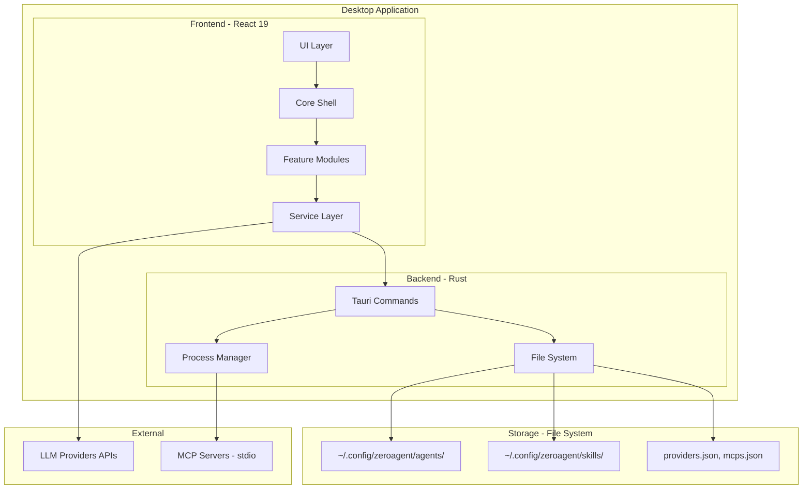
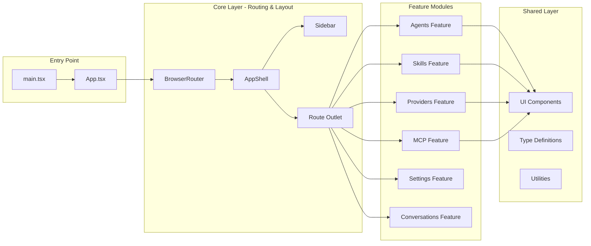
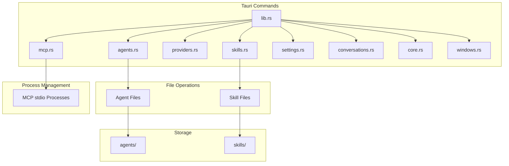
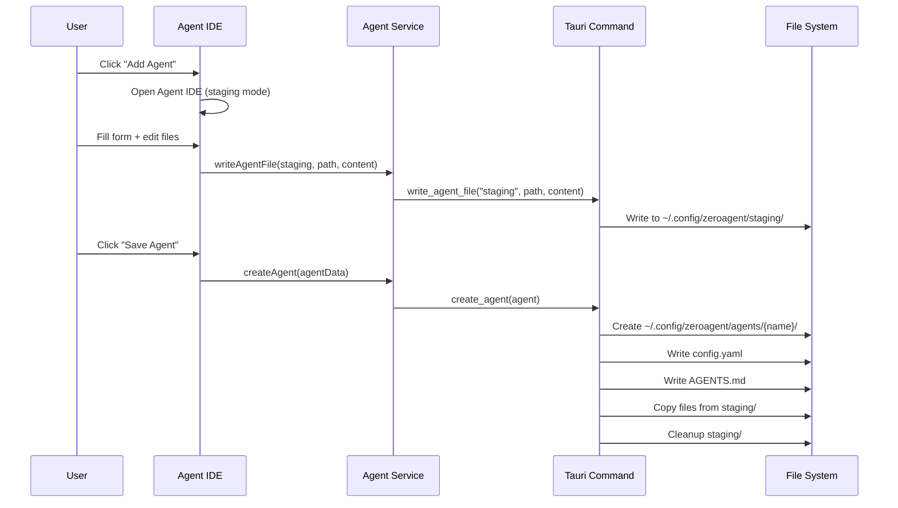
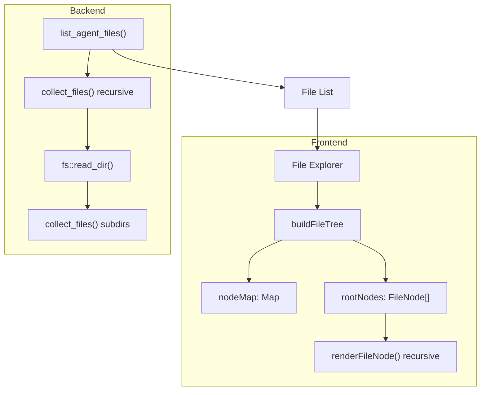
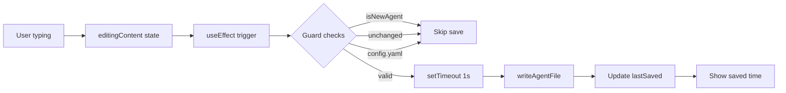
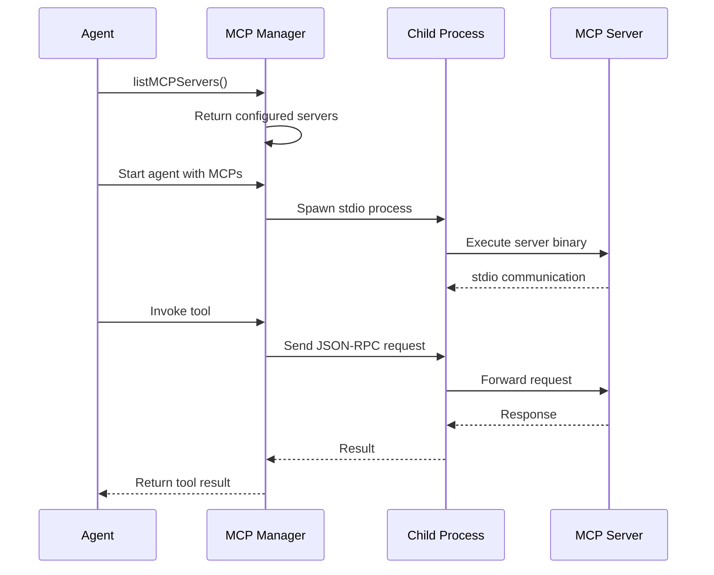
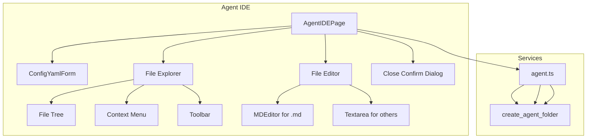
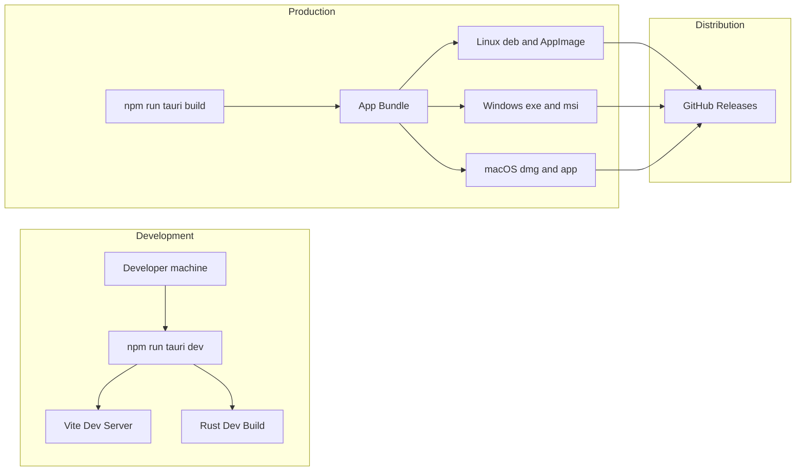

# Agent Zero - Architecture Documentation

## Solution Architecture

### High-Level Overview

Agent Zero follows a **modular desktop architecture** with clear separation between the Rust backend (system access, file I/O, process management) and React frontend (UI, state management, user interactions).



## Technical Architecture

### Frontend Structure



### Backend Command Structure



### Domain Organization

The codebase is organized by **business domain**, not technical layer:

```
src/
├── core/              # Cross-cutting (routing, layout)
│   ├── layout/        # AppShell, Sidebar, StatusBar
│   └── utils/         # Shared utilities
├── features/          # Feature modules
│   ├── agents/        # Agent management + IDE
│   ├── skills/        # Skill management + IDE
│   ├── providers/     # LLM provider config
│   ├── mcp/           # MCP server management
│   ├── settings/      # App settings
│   └── conversations/ # Chat interface
├── shared/            # Shared across features
│   ├── types/         # TypeScript definitions
│   ├── ui/            # UI component library
│   ├── constants/     # Routes, constants
│   └── utils/         # Helper functions
└── services/          # API abstraction layer
```

**Why this structure?**
- Easy to find code by feature
- Clear boundaries between features
- Independent feature development
- Better onboarding for new developers

## Data Flow

### Agent Creation Flow



### File Explorer with Subdirectories



### Auto-Save Flow



### MCP Server Communication



## Component Relationships

### Agent IDE Components



## State Management Strategy

### Local Component State (Preferred)

Most state is kept local to components:

```typescript
// File explorer state in Agent IDE
const [files, setFiles] = useState<AgentFile[]>([]);
const [selectedFile, setSelectedFile] = useState<AgentFile | null>(null);
const [expandedFolders, setExpandedFolders] = useState<Set<string>>(new Set());
```

**Why?**
- Simpler than global state
- State close to where it's used
- Easier to reason about
- No need for Zustand/Redux at current scale

### When to Use Global State (Future)

- User session info
- Active conversation state
- Global app settings

## Technology Decisions

### Tauri over Electron

| Aspect | Tauri | Electron |
|--------|-------|----------|
| Bundle Size | ~10MB | ~100MB+ |
| Memory | Lower | Higher |
| Backend | Rust | Node.js |
| Security | Smaller attack surface | Larger |
| Native Integration | Better | Good |

### React Router over Tauri Router

- Client-side routing (faster)
- Works with web standards
- Easier testing/debugging
- No IPC overhead for navigation

### Custom File Explorer over Tree View Library

- Full control over behavior
- Consistent styling with app
- Recursive pattern is straightforward
- No additional dependency

## Storage Patterns

### Agent Storage

```
~/.config/zeroagent/agents/
├── {agent-name}/
│   ├── config.yaml      # Metadata (name, provider, model, etc.)
│   ├── AGENTS.md        # Instructions (plain markdown)
│   └── [user files]/    # Additional resources
```

### Skill Storage

```
~/.config/zeroagent/skills/
├── {skill-name}/
│   ├── SKILL.md         # Frontmatter + markdown
│   ├── assets/          # Placeholder folder
│   ├── resources/       # Placeholder folder
│   └── scripts/         # Placeholder folder
```

### Configuration Files

```json
// ~/.config/zeroagent/providers.json
[{ "id": "openai", "name": "OpenAI", "baseUrl": "...", "models": ["gpt-4"] }]

// ~/.config/zeroagent/mcps.json
[{ "id": "filesystem", "name": "Filesystem", "command": "npx", "args": ["-y", "@modelcontextprotocol/server-filesystem", "/path"] }]
```

## Security Considerations

1. **API Keys**: Stored in provider config, user-managed
2. **File Access**: Agents/skills can access files in their folders only
3. **MCP Servers**: Run in child processes, isolated
4. **Staging Cleanup**: Prevents orphaned files on cancel

## Performance Optimizations

1. **Debounced Auto-Save**: 1 second delay prevents excessive IPC
2. **Set for Expanded Folders**: O(1) lookup vs O(n) array search
3. **Lazy Loading**: File explorer only loads when needed
4. **Conditional Markdown Editor**: Only for .md files

## Deployment Architecture



## Extension Points

1. **New Features**: Add to `src/features/`
2. **New Commands**: Add to `src-tauri/src/commands/`
3. **UI Components**: Add to `src/shared/ui/`
4. **Services**: Add to `src/services/`

## Known Limitations

1. No cloud sync (local-only)
2. Single-user design
3. No real-time collaboration
4. macOS/Windows/Linux desktop only
