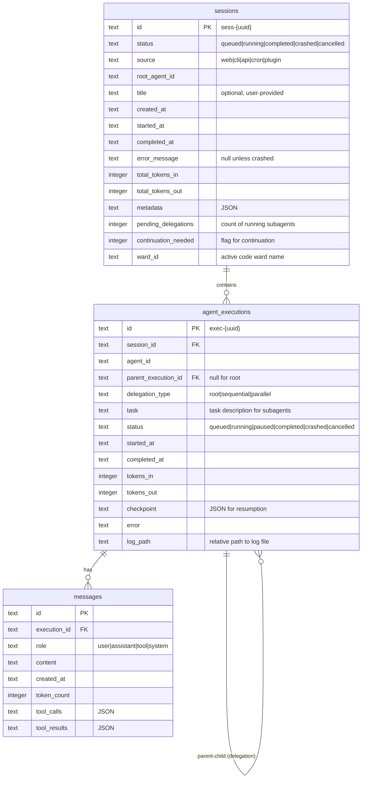

# Data Model

Database schema for AgentZero gateway. SQLite-based.

## Entity Relationship Diagram



## Tables

### sessions
Top-level container for a user's work session. A new session is created when:
- First message sent without `session_id`
- User sends `/new` command (clears frontend session_id)

| Column | Type | Description |
|--------|------|-------------|
| id | TEXT PK | `sess-{uuid}` |
| status | TEXT | `queued`, `running`, `completed`, `crashed`, `cancelled` |
| source | TEXT | `web`, `cli`, `api`, `cron`, `plugin` - trigger origin |
| root_agent_id | TEXT | The primary agent for this session (default: `root`) |
| title | TEXT | Optional user-provided title |
| created_at | TEXT | ISO8601 timestamp |
| started_at | TEXT | When first execution began |
| completed_at | TEXT | When session finished |
| error_message | TEXT | Error details if status is `crashed` |
| total_tokens_in | INTEGER | Sum of all agent execution tokens |
| total_tokens_out | INTEGER | Sum of all agent execution tokens |
| metadata | TEXT | JSON metadata |
| pending_delegations | INTEGER | Count of running subagents |
| continuation_needed | INTEGER | Flag: continue after all delegations complete |
| ward_id | TEXT | Active code ward name (persists across session turns) |

### agent_executions
An agent's participation in a session. Root agent or delegated subagent.

| Column | Type | Description |
|--------|------|-------------|
| id | TEXT PK | `exec-{uuid}` |
| session_id | TEXT FK | References sessions.id |
| agent_id | TEXT | Agent ID from config |
| parent_execution_id | TEXT FK | Null for root, references parent for subagents |
| delegation_type | TEXT | `root`, `sequential`, `parallel` |
| task | TEXT | Task description (for subagents) |
| status | TEXT | `queued`, `running`, `paused`, `completed`, `crashed`, `cancelled` |
| started_at | TEXT | When execution began |
| completed_at | TEXT | When execution finished |
| tokens_in | INTEGER | Input tokens consumed |
| tokens_out | INTEGER | Output tokens generated |
| checkpoint | TEXT | JSON checkpoint for resumption |
| error | TEXT | Error message if crashed |
| log_path | TEXT | Relative path to execution log file |

### messages
Individual messages in an agent's conversation.

| Column | Type | Description |
|--------|------|-------------|
| id | TEXT PK | UUID |
| execution_id | TEXT FK | References agent_executions.id |
| role | TEXT | `user`, `assistant`, `tool`, `system` |
| content | TEXT | Message content |
| created_at | TEXT | ISO8601 timestamp |
| token_count | INTEGER | Token count for this message |
| tool_calls | TEXT | JSON array of tool calls |
| tool_results | TEXT | JSON array of tool results |

## Indexes

```sql
-- sessions
CREATE INDEX idx_sessions_status ON sessions(status);
CREATE INDEX idx_sessions_created ON sessions(created_at);

-- agent_executions
CREATE INDEX idx_executions_session ON agent_executions(session_id);
CREATE INDEX idx_executions_parent ON agent_executions(parent_execution_id);
CREATE INDEX idx_executions_status ON agent_executions(status);
CREATE INDEX idx_executions_agent ON agent_executions(agent_id);

-- messages
CREATE INDEX idx_messages_execution ON messages(execution_id);
CREATE INDEX idx_messages_created ON messages(created_at);
```

## Execution Logs (Filesystem)

Logs are stored as JSON Lines files on disk, not in the database.

```
data/
└── logs/
    └── {session_id}/
        ├── exec-abc123.jsonl     # root agent logs
        ├── exec-def456.jsonl     # subagent 1 logs
        └── exec-ghi789.jsonl     # subagent 2 logs
```

Each line is a JSON object:
```json
{"ts":"2024-01-15T10:00:00Z","level":"info","cat":"llm","msg":"Starting turn","meta":{}}
{"ts":"2024-01-15T10:00:01Z","level":"debug","cat":"tool","msg":"Calling read_file","meta":{"path":"/foo"}}
```

**Log levels**: `debug`, `info`, `warn`, `error`
**Categories**: `llm`, `tool`, `delegation`, `middleware`, `system`

To clean up: delete `data/logs/{session_id}/` directory when session is deleted.

## Status Semantics

### Session Status
- `queued` - Session created but not yet started
- `running` - At least one agent execution is running
- `completed` - All executions completed successfully
- `crashed` - Root execution crashed (subagent crash may not crash session)
- `cancelled` - User cancelled the session

### Execution Status
- `queued` - Waiting to start
- `running` - Currently executing
- `paused` - Paused (session paused or waiting)
- `completed` - Finished successfully
- `crashed` - Failed with error
- `cancelled` - Cancelled by user or parent

## Delegation Flow

```
User sends message
    │
    ▼
Session created (or resumed)
    │
    ▼
Root agent_execution created (delegation_type=root)
    │
    ▼
Root agent runs, decides to delegate
    │
    ├──► Subagent A execution (delegation_type=parallel, parent=root)
    │        └── Runs independently
    │
    ├──► Subagent B execution (delegation_type=parallel, parent=root)
    │        └── Runs independently
    │
    ▼
Root waits for parallel subagents
    │
    ▼
Root processes results, delegates again
    │
    └──► Subagent C execution (delegation_type=sequential, parent=root)
             └── Runs, returns result
    │
    ▼
Root completes → Session completes
```

## Dashboard API Types

### DashboardStats
Response from `GET /api/executions/stats/counts`:

```typescript
interface DashboardStats {
  sessions_running: number;
  sessions_queued: number;
  sessions_completed: number;
  sessions_crashed: number;
  sessions_cancelled: number;
  executions_running: number;
  executions_queued: number;
  executions_completed: number;
  executions_crashed: number;
  sessions_by_source: Record<TriggerSource, number>;
}

type TriggerSource = 'web' | 'cli' | 'api' | 'cron' | 'plugin';
```

### SessionWithExecutions
Response from `GET /api/executions/v2/sessions/full`:

```typescript
interface SessionWithExecutions {
  session: Session;
  executions: AgentExecution[];
  subagent_count: number;  // Count of non-root executions
}

interface Session {
  id: string;              // "sess-{uuid}"
  status: SessionStatus;
  source: TriggerSource;
  created_at: string;      // ISO8601
  updated_at: string;      // ISO8601
  completed_at?: string;
  error_message?: string;
}

interface AgentExecution {
  id: string;              // "exec-{uuid}"
  session_id: string;
  agent_id: string;
  parent_execution_id?: string;  // null for root agent
  conversation_id: string;
  status: ExecutionStatus;
  turn_count: number;
  started_at: string;
  completed_at?: string;
  error_message?: string;
}

type SessionStatus = 'queued' | 'running' | 'completed' | 'crashed' | 'cancelled';
type ExecutionStatus = 'queued' | 'running' | 'completed' | 'crashed';
```

## Stats Queries

**Active sessions:**
```sql
SELECT COUNT(*) FROM sessions WHERE status = 'running';
```

**Completed sessions:**
```sql
SELECT COUNT(*) FROM sessions WHERE status = 'completed';
```

**Sessions by source:**
```sql
SELECT source, COUNT(*) as count
FROM sessions
GROUP BY source;
```

**Session with all its executions:**
```sql
SELECT s.*, e.*
FROM sessions s
LEFT JOIN agent_executions e ON e.session_id = s.id
WHERE s.id = ?
ORDER BY e.started_at;
```

**Subagent count for a session:**
```sql
SELECT COUNT(*) FROM agent_executions
WHERE session_id = ? AND parent_execution_id IS NOT NULL;
```
